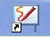
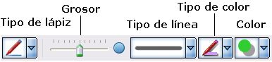

# 1.1.1.Igual que con la pizarra tradicional

Iniciamos aquí una serie de **propuestas de ejercicios** o actividades para conocer el software StarBoard 9.20.

No son obligatorios, pero sí que **orientan para la realización de la Tarea 2.2**.obligatoria. Intentan seguir un orden de menor a mayor grado de preparación y dificultad por lo que te pueden servir para ir conociendo más a fondo las diferentes herramientas y posibilidades.

Fig.2.7.De:Thomas J. O'Halloran, U.S. News & World Report Magazine. [Dominio Público](http://commons.wikimedia.org/wiki/File:Mark_Muir_Mills.jpg?uselang=es#filelinks)

## Caso práctico

Vamos a crear un fichero con el software de nuestra PDI, tal y como lo haríamos dentro del aula, es decir, utilizando la **PDI a modo de pizarra tradicional**. Podríamos, dentro de una explicación de nuestra área correspondiente, incluir algún **texto o anotación a mano alzada**:

El enunciado de un problema, una frase para analizar, el día y fecha, nuestro nombre..... Probamos diferentes colores, grosores,...

var feedbackquesFeedback0b15text = "Mostrar retroalimentación";

### Retroalimentación

Ya se ha visto en el apartado de presentación del Software cómo se puede empezar a escibir con la "tinta" de la PDI. Lo resumimos:

1.- **Iniciamos** el programa StarBoard 9.20 (Fig.2.8)

2.- Seleccionamos la herramienta "**Lápiz**" de la barra de herramientas.(Fig.2.9) o desde el menú _Herramientas_>_Lápiz normal_

3.- Elegimos las opciones en la **_barra de opciones_** inferior.

                                 Fig.2.10.Captura del Programa

4.- Tras escribir, señalar, rodear..... **guardamos** el proyecto. Seleccionamos el botón "Guardar" (Fig.2.11) de la barra de herramientas, o bien, Menú > Archivo > Guardar (Ctrl.+S).

Elegimos la ubicación y el nombre para guardar. El programa añadirá automáticamente la extensión (.yar).

## Importante

Uno de los usos más extendidos y sencillos de la PDI es utilizar todo lo que el ordenador nos ofrece, pero beneficiándonos del software propio de la PDI.

Basta con pulsar el icono del menú (o bien _Tema_\> _Escitorio_), para ver nuestro **escritorio** y poder utilizar todo lo que en él hay pero con las herramientas de la PDI, activadas en un menú flotante (Word, Power point, Internet, DVDs o CDs,.....).

