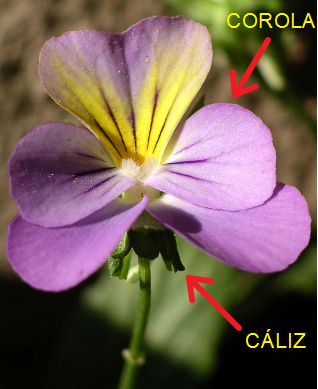
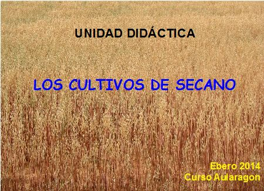
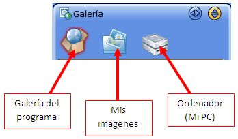
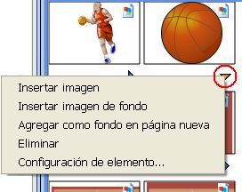
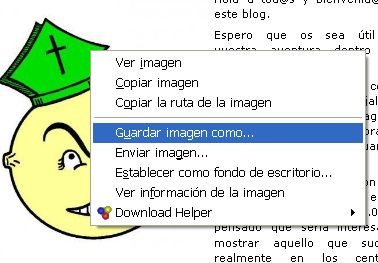
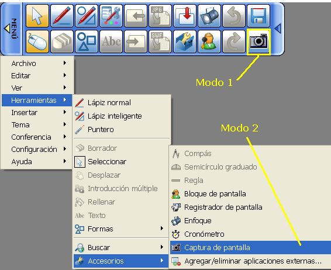
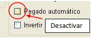
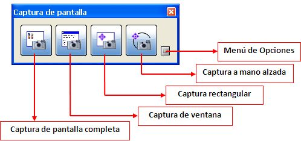
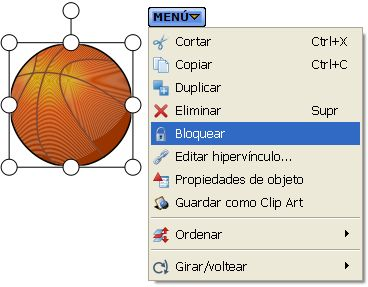

# 1.1.2.Imágenes y texto

Vamos a intentar hacer algo como ésto:

                         Fig.2.12. Realización propia.

Fig.2.13. Realización propia.

                  

## Caso práctico

Crearemos un archivo en el que se incluya imagen y texto. El objetivo es doble: aprender **cómo trabajar con imágenes** integrándolas en una diapositiva; y utilizar la herramienta de **texto " a máquina"**, a diferencia del ya visto "a mano alzada".

Puede ser la portada de nuestra unidad didáctica, una imagen con explicaciones superpuestas, un mapa, una lámina de anatomía,....

var feedbackquesFeedback0b17text = "Mostrar retroalimentación";

### Retroalimentación

**1-** Una vez abierto el software, vamos a **insertar una imagen**. Para ello hay varios procedimientos:

*   **Desde la Galería**: (Recuerda que si trabajas con el software portable no tendrás imágenes incluidas)

Fig.2.14. Captura del programa

Tanto si eliges una imagen de la galería del programa como de "mis imágenes", **bastará arastrarla** y soltarla en el lugar que deseemos (como vimos en el tutorial inicial).

Si se toca con el cursor **se puede mover la imagen o modificarla**.

La propia galería nos da opciones para insertar las imágenes, desde el pequeño triángulo que tienen debajo.

Fig.2.15. Captura del programa

*    **Una imagen de Internet:**

Elegimos una imagen de internet (No olvides mirar el anexo a este tema "**Licencias y Permisos**"). Podemos "Copiar imagen" o "Guardar imagen como...".

Si has elegido **copiar**, bastará con ir al lugar donde quieras colocarla y seguir la ruta **Menu>Edición>Pegar** o **Ctrl+V**.

Si has elegido **guardar imagen**, para colocara en la pizarra deberás seguir la ruta **Menu>Insertar>Imagen**

Fig.2.16. Captura del programa

**Una captura de pantalla**:

Fig.2.17. Captura del programa

Fig.2.18. Captura del programa

Pulsar el botón de **Modo PC **(Modo Ratón), que nos permite acceder al ordenador como tal.  Buscamos la imagen que deseamos capturar y activamos la herramienta "_Captura de pantalla_".  

Lo que abre estas opciones:

 Fig.2.19. Captura del programa

 Lo recomendable es ir al _Menú de Opciones_ y **desactivar _Pegado_ _automático_** (Fig.2.18) ya que si no al hacer una captura, la pegará automáticamente en una nueva página al final del documento.

Si has desactivado esa opción,una vez hecha la captura, se vuelve al programa de la PDI, pulsando en el **botón de Modo PC** (Modo Ratón), y se pega la imagen del portapapeles con las teclas **CTRL+V**, o bien, con **Menú > Edición > Pegar**.

**2-** Para poder escribir sobre la imagen, hay que **bloquearla** (ésto se puede hacer con cualquier objeto). Además ésto protege la imagen de ser borrada o alterada de algún modo. (para desbloquearla se repite el proceso).Fig.2.20.

**3-** **Introducimos el texto**: **Menú > Herramientas > Texto.**

En la **barra contextual de opciones** de la parte inferior, podemos modificar la fuente, el tamaño, la alineación, las características o el color del texto (como vimos en el tutorial inicial).  

Fig.2.21. Captura del programa

Fig.2.20. Captura del programa

**4- Guardar** el proyecto.

## ParaSaberMas

Si quieres realizar a mano alzada figuras geométricas, flechas de señalización,.... pero no te gusta cómo te quedan, cuentas con la herramienta "**Lápiz inteligente**" que las mejorará por tí.

Cuando la tienes activada, **interpreta algunos trazos** (figuras geométricas básicas, flechas,....) **y los perfecciona**. En Configuración > Preferencias > Lápiz inteligente, podrás ver las posibilidades de esta herramienta. También borra cualquier objeto realizando una x sobre él.

Otra herramienta que permite introducir objetos similares (formas básica, flechas,...) es "**Formas**" .

## Importante

Si quieres poder **cambiar el tamaño de las imágenes** para que no ocupen tanto espacio mira en **"Ampliación de contenidos"**, al final del tema.

