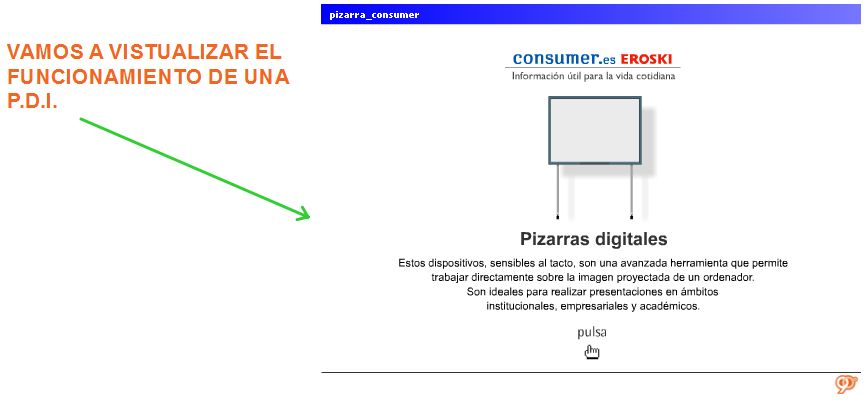
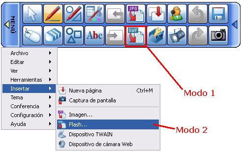

# 1.1.3.Animaciones Flash

## ¿Que es una animación Flash?

Es un formato de archivo de gráficos vectoriales, con la extensión .SWF, que suelen utilizarse como animaciones en sitios web, aunque también pueden funcionar de forma autónoma sin conexión a internet.

Sería ésto:

## ¿Qué ofrece?

*   Son animaciones, con lo que son motivadoras y llaman la atención rápidamente. Una imagen vale más que mil palabras.
*   Pueden ser interactivos, requiriendo la participación del alumnado.
*   Ocupan poco espacio.
*   Pueden integrarse fácilmente en la web, o trabajarse sin conexión a internet.

## Caso práctico

Vamos a incrustar una animación flash en una actividad de la PDI.

Podría quedar algo así:

¿Te atreves a hacerlo tú?

Fig.2.23:Creación propia.

var feedbackquesFeedback0b23text = "Mostrar retroalimentación";

### Retroalimentación

Insertar el archivo Flash es bastante sencillo:

Fig.2.24:Captura del programa

Pulsamos el **botón Flash (SWF)** (Modo1) si lo tenemos en la barra de herramientas, o bien, acudimos a **Menú > Insertar > Flash **(Modo2), como se puede ver en la Fig.2.24.

Buscamos en el explorador en qué ubicación tenemos guardada la animación a insertar y pulsamos **Abrir**.

Al igual que las imágenes, las animaciones Flash son objetos que pueden moverse, redimensionarse o eliminarse de forma análoga a las primeras.

## Para saber más

## **Perfil en StarBoard:**

Con el software StarBoar de Hitachi, se puede **personalizar la barra de herramientas flotante** (lo que el programa denomina _**Perfil**_) y además este perfil se puede guardar y volver a cargar para trabajar siempre con la barra de herramientas que prefieras. En este vídeo te explicamos estas posibilidades:

