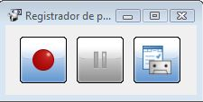

# 1.1.4.Vídeo

Tal vez la interacción con elementos multimedia sea la que peor resuelta esté en esta versión de StarBoard, ya que **no dipone de una opción específica para su inclusión** en la pizarra (como Notebook de Smart o Actvinspire de Promthean que sí la poseen) .

Los audios (mp3) y vídeos (wmv o mpg) se pueden **abrir o importar**, pero sólo los vídeos quedan integrados en el documento StarBoaard, no así los audios que se abren con el reproductor que tengamos instalado.

Existe la posibilidad de integrar vídeo y audio en una explicación que preparemos, como **archivos adjuntos**, usando la opción de crear **hipervínculos**, como se muestra a continuación:

## ParaSaberMas

### **Herramienta de grabación de la propia PDI**:

Todos los softwares de PDI tienen la **posibilidad de grabar o registrar todo lo que ocurre en la pantalla** del ordenador (Excepto Open Sankoré que sólo graba audio)

En el caso de StarBoard, lo encontramos en la ruta:

Herramientas > Accesorios > **Registrador de pantalla**.

Es una herramienta muy sencilla con el símbolo de grabación, pausa y la posibilidad de algunos ajustes (lugar de guardado, con o sin sonido,...).

¡Anímate a probarlo!

(La versión portable no tiene habilitada esta opción)

Fig.2.32. Captura del programa

