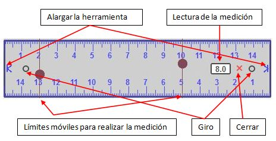
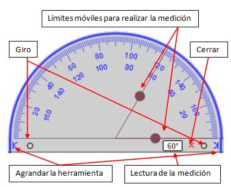
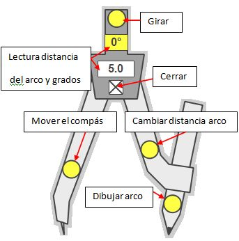

# 1.1.5.Una exposición diferente

Todos los softwares de PDI cuentan con una serie de recursos que pueden ayudar a hacer las exposiciones en el aula más interesantes y atractivas o simplemente a mejorarlas.

En StarBoard están agrupadas dentro del apartado _Accesorios_, en el menú Herramientas (excepto el zoom).

Aquí se muestran, además del zoom, los accesorios _Enfoque_ y _Bloque de pantalla_:

 

## Caso práctico

¿Y si tengo que explicar en la PDI cómo realizar mediciones o cómo dibujar con un compás? ¿Utilizo los que tenía de la pizarra tradicional?

Lo cierto es que los diferentes modelos de PDI han pensado en esta posibilidad y todos incluyen elementos de medida y dibujo (Regla, Transportador y Compás,.... en algunos casos también escuadras).

Anímate a descubrir cómo funcionan.

var feedbackquesFeedback0b40text = "Mostrar retroalimentación";

### Retroalimentación

Como habrás visto son elementos de manejo muy sencillo que no ofrecen mucho más que los que teníamos en las antiguas pizarras pero que simplifican bastante la taera. Una ventaja que ofrecen es que, una vez activados, son visibles sobre cualquier documento que abras en el ordenador.

\- **Regla**:

Fig.2.37. Captura del programa elaboración propia

\- **Compás**:

\- **Transportador**:

Fig.2.38. Captura del programa elaboración propia

Fig.2.39. Captura del programa elaboración propia

