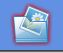
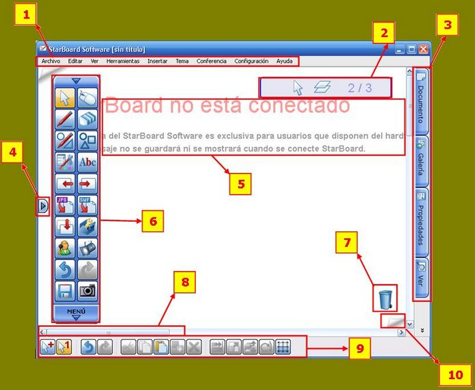

# 1.1.El Software

Vamos a ir conociendo el entorno de trabajo que vamos a encontrar al trabajar con **SmarBoard 9.20**. y algunas de sus posibilidades...

**Intenta realizar estas tareas** con el software de tu equipo (Si trabajas con la versión portable, la Galería de imágenes estará vacía pero puedes usar las que tengas en el ordenador desde el icono de la galería)

<object type="application/x-shockwave-flash" data="http://aularagon.catedu.es/materialesaularagon2013/pdi/CURSO/ZIPs/Modulo_2/Entornodetrabajo.swf" width="800" height="600"><param name="src" value="http://aularagon.catedu.es/materialesaularagon2013/pdi/CURSO/ZIPs/Modulo_2/Entornodetrabajo.swf"></object>

## Actividad desplegable

¿Quién es quién? A ver si reconoces los principales elementos de la mesa de trabajo de StarBoard

%accordion%Solución%accordion%

1. Barra de menús superior (fija)
2. Cuadro informativo (herramienta, capas, nº páginas)
3. Pestañas laterales
4. Posición pestañas laterales
5. Texto que indica que no hay pizarra conectada (o la pizarra no es de esta marca)
6. Barra de menús móvil (configurable)
7. Papelera (Eliminar objetos)
8. Barras de desplazamiento
9. Barra contextual de opciones (en función de la herramienta seleccionada)
10. Avanza de página

%/accordion%

