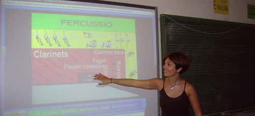

# 2.1.Primeras Sesiones

"Lo que nos funciona en el ordenador, nos funcionará en la PDI".

Esta afirmación tan simple es clave para lanzarnos al uso de la PDI en clase. Recuerda que si tenemos conectada la PDI y el Proyector como ya hemos visto, el puntero o el dedo, se convierten en el "ratón" que desde la superficie de la PDI nos permite manejar el ordenador.

¿Cuándo emplearla?

Cuando la interacción, que nos ofrece la PDI, facilite el aprendizaje de los contenidos tratados.

*   Introducimos un tema (vídeo, presentación,....)
*   Preparamos un esquema del tema.
*   Ilustramos conceptos(imágenes, láminas,..)
*   Queremos que participe el alumnado (propuestas, actividades interactivas,...)
*   Necesitamos centrar la atención del alumnado en un contenido (noticia, imagen para e debate,...)
*   Nos interesa mostrar la información de forma gradual (con recursos de la pdi como el foco o la cortina)

 Nuestra metodología no va a cambiar de forma radical de un día para otro. La usaremos de forma gradual, ajustándonos a las necesidades del aula y a la seguridad que vayamos adquiriendo en su uso. Cada docente deberá decidir lo que hace con la PDI en su aula.

Algunas ideas:

*   Uso SIN software específico de PDI:

-  Navegar por páginas web , bien estáticas o dinámicas, mapas interactivos...

\- Visualizar documentos, (como hasta ahora, de pie en la pizarra. No permite hacer anotaciones manuscritas): un texto, una presentación, un pdf, una imagen, un vídeo...

\- Ejecutar programas específicos de las distintas áreas: Kidspiration, ArtRage, ...

\- Ejecutar  aplicaciones hechas con generadores de actividades tipo flash, javaclic, Ardora, Edilim, Hotpotatoes..

\- Libros interactivos multimedia o libros digitales de diferentes editoriales.

\- Hacer uso de la tinta digital, marcas, textos,.... con algunos programas habituales como: presentaciones realizadas con Power Point, PDF, programas propios del Tablet PC (Journal, ArtRage,...)

*   Uso CON el software de la PDI:

Además de poder hacer lo mismo que sin él, nos ofrece la ventaja de tener herramientas activas que facilitan el trabajo.

\- Uso de la pizarra blanca para escribir. No requiere el conocimiento a fondo del software:  sobre la marcha, se va escribiendo como en la pizarra tradicional.

\- Hacer anotaciones sobre todo tipo de documentos (texto, presentaciones, hojas de cálculo, imágenes, vídeo...). Basta con abrir el documento desde el software de la pizarra. No permite modificar el original, pero sí escribir sobre él.

\- Hacer anotaciones sobre un documento proyectado con una cámara web: libro, corregir ejercicios...

Todo ello, no se puede dejar al hazar, habrá que preparar los documentos, iménes, vídeos,.... de manera que en un lápiz de memoria lo tengamos todo listo. Además en el caso del software de la PDI, la sesión se puede guardar y reutilizarse en otra aula con la misma pizarra.

## Importante

La  PDI  **la  usaremos  cuando  sea  necesaria:**  por  el  tipo  de  actividad,  como  recurso  o  como herramienta motivadora y de ampliación. Usar por usar la pizarra, puede llevar a "quemar" la herramienta en el aula. Abusar del recurso significa limitar sus posibilidades y funciones.

## Reflexión

Tras esta primera aproximación, y partiendo de tu experiencia, conocimientos y realidad de aula....

Piensa en esa hipotética primera sesión con PDI... ¿cómo la abordarías? ¿que te prepararías? ¿y el alumnado?....

Abajo puedes ver algunas propuestas... seguro que a tí se te ocurren más.

%accordion%Solución%accordion%

Apoyar la explicación:

Vídeos existentes en la red, contenidos en los materiales complementarios que aportan las editoriales, cortes concretos  de  películas  y  documentales  que  existan  en  la  biblioteca  del  centro  o  departamento, una página web determinada (sabiendo perfectamente dónde tenemos que acudir y no estar dudando o divagando), un archivo interactivo (tipo flash),...

Crear  escritorios de enlaces de interés:

Es una forma sencilla de introducirse en el uso de la PDI (lo denominamos "lanzadera") creando para el área, la sesión,... una página con los enlaces que vayamos a necesitar o los más habituales. Por ejemplo. Está claro que durante una clase pueden surgir dudas sobre una palabra: su ortografía, su conjugación, etc. En ese momento el docente siempre tiene a su disposición un enlace al buscador de la RAE, tan solo es cuestión de hacer clic en el enlace y otra página se abre, introducimos con la PDI nuestra consulta y la respuesta se muestra para todos.

Presentación por parte del alumnado:

De un trabajo elaborado, las conclusiones de un debate, un proceso,.... Para ello habrá que compartir  con  el  alumnado los  recursos,  de  dónde  se puede obtener  la  información  sobre  un tema concreto, las páginas  web  más apropiadas,... es decir guiar (en función de la edad) el proceso previo.

Consultar y analizar la prensa:

Desde el análisis de la noticia en sí (titular, cuerpo,...) hasta el debate, el comentario. Servir de introducción y motivación al tema que se va tratar. Establecerlo com hábito de comienzo de la sesión,....

Corregir y resolver actividades:

Aademás de la típica corrección, podemos corregir rellenando plantillas previamente preparadas, que luego se reutilizan en las clases siguientes, presentar los trabajos con un procesador de texto o en un programa de presentación (power point, impress o similar) adecuado al nivel y al área (se puede hacer bases sobre las que colocar las respuestas),ejercicios ya preparados autocorregidos....

Contactar  con  especialistas  y  grupos  a  distancia:

Las posibilidades de una videoconferencia con otros grupos o con un especialista (un escitor, por ejemplo) abre grandes posibilidades, no sólo en cuanto a contenidos (preparar la entrevista, un tema en concreto,...) sino también en cuanto a los idiomas (conectar con el extranjero).

%/accordion%

