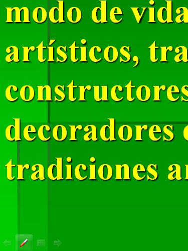
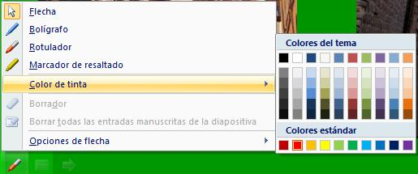
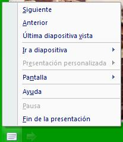
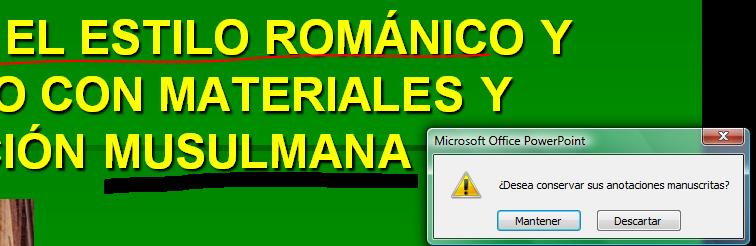
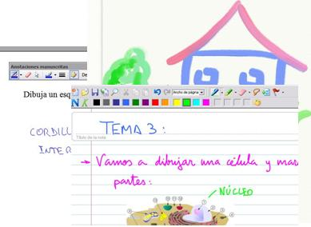
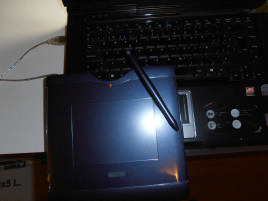

# 2.2.¡No conozco el Software!

Esa no es una excusa para no usar la PDI. No desesperes...

En principio contamos con materiales que hemos ido elaborando con anteriorridad: Presentaciones, documentos en pdf o realizados con un editor de textos, esquemas,...

 Todo ello nos sirve. **No es indispensable conocer el software propio de la pizarra** (si bien, en general, va a ser **necesario tenerlo instalado** para interactuar con la pantalla de la PDI o bien para calibrar u orientar el puntero/dedo)

(En el próximo módulo trabajaremos con el software de la PDI, pero para evitar confusiones, sería conveniente consultar el apartado 2.3.3. **Aclaración** de esta unidad).

Veamos un ejemplo:

Fig.1.21.Licencia: [Algunos derechos reservados](http://creativecommons.org/licenses/by/2.0/ "Attribution License") por [Daquella manera](http://www.flickr.com/photos/daquellamanera/).

En [http://www.flickr.com/photos](http://www.flickr.com/photos/daquellamanera/195091209/sizes/m/in/photostream/)

 Pongamos por caso que contamos con una **presentación** (sólo para PowerPoint) muy interesante para introducir el tema que vamos a trabajar.

Fig.1.22: Captura de pantalla de PowerPoint  

Además de poderla "pasar" desde la pantalla de la PDI al tiempo que explicamos, si nos fijamos en la zona inferior izquierda de la diapositiva, veremos unas flechas (que permiten, al pulsar en ellas, pasar la diapositivas adelante y atrás) y un recuadro que nos permite realizar múltiples acciones sobre la presentación (Fig.1.23)

Nos falta un último icono , que ofrece varias posibilidades para escribir o marcar sobre las diapositivas.

Fig.1.24: Captura de pantalla de PowerPoint

Fig.1.23: Captura de pantalla de PowerPoint

Así pues, podemos subrayar, rodear,.... borrar lo hecho... y además, si queremos, podemos guardar las anotaciones realizadas:

Fig.1.25: Captura de pantalla de PowerPoint

¿Conocías estas posibilidades?

Éstas y muchas otras posibilidades puedes tener si trabajas **con Tablet PC**: todos los programas que permiten entradas manuscritas (Journal, ArtRage, Entradas manuscritas de Word,.....) va a permitir que las uses desde la pantalla de la PDI.

Fig.1.26: Capturas de pantalla  

## Propuesta de Actividad

Vamos a ponernos en situación:

Queremos comenzar a usar la PDI y lo vamos a hacer sobre una presentación de PowerPoint, bien ya hecha o realizada para la clase que vamos a dar.

Vas a exponer la presentación como si estuvieses en clase (si lo haces de verdad ¡fenomenal!) y vas a ir marcando, subrayando, añadiendo señales,.... tal cual lo harías en la realidad.

Lo ideal sería hacerlo sobre una PDI, pero en caso de que no puedas acceder a ella, puedes utilizar la pantalla del Tablet o, en su defecto, una Tableta Gráfica (como la de abajo) que permite escribir sobre la pantalla.

Fig.1.27: Imagen Propia  

Si tenes cualquier duda no dudes en consultarlo mediante el correo del curso.

var feedbackquesFeedback0b38text = "Mostrar retroalimentación";

### Retroalimentación

No hay una solución única, cada cual habrá realizado aquello que sea más propio de su área o nivel. Tan sólo algunas consideraciones de cara al futuro:

Cuando realices este tipo e actividad deberás tener en cuenta el tamaño del archivo final (si utilizas muchas imágenes de gran resolución, el archivo puede ser enorme), si te interesa o no guardar las anotaciones y, especialmente, el aprovechamiento que a esta posibilidad le puedes dar en el aula (sólo explicas tú, participa el alumnado.... es sólo expositivo, presenta cuestiones a responder, partes sin completar,....).

