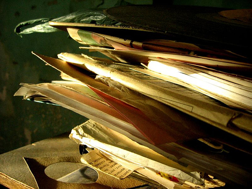
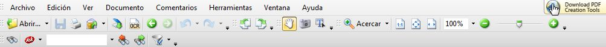
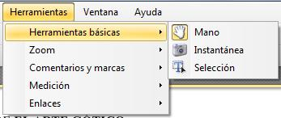
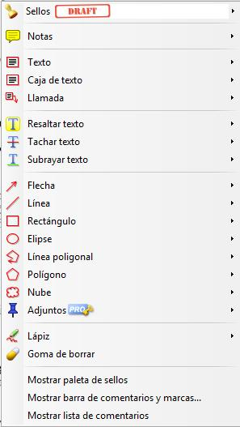
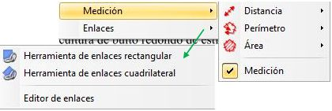
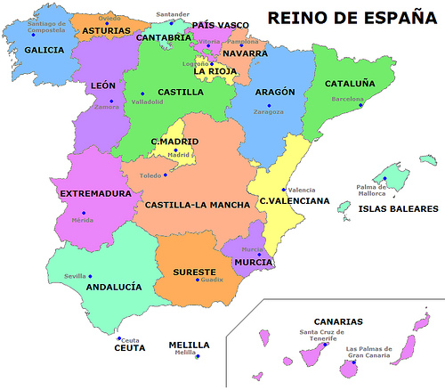
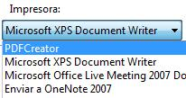
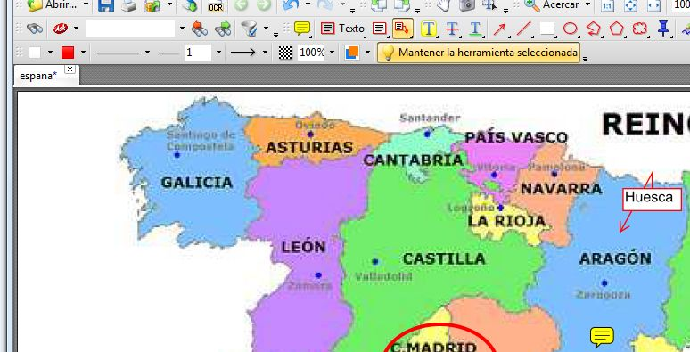

# 2.3.1.PDF-XChange Viewer

## \- PDF-XChange Viewer

Como hemos comentado en el apartado anterior todos tenemos material didáctico acumulado que podemos aprovechar con la PDI. Hemos visto el caso de las Presentaciones PowerPoint) pero... ¿**qué pasa con los PDF**?

Fig.1.29.Licencia: [Algunos derechos reservados](http://creativecommons.org/licenses/by-sa/2.0/ "Attribution-ShareAlike License") por [cyph3r](http://www.flickr.com/photos/cyph3r/) En: [http://www.flickr.com/photos](http://www.flickr.com/photos/cyph3r/1811328677/sizes/m/in/photostream/)

Sin duda es un formato universal en el que seguro que tenemos gran cantidad de documentos, pero... "el lector que tengo instalado no me permite interactuar con él, si no es con el software de la PDI", pues bien, esta afirmación no es del todo cierta.

Hay lectores de PDF, que permiten interactuar sobre el documento. Vamos a presentar uno llamado **PDF-XChangeViewer**, que permite escribir y marcar sobre los documentos PDF. Es gratuito y se puede instalar de forma fija en tu ordenador (en lagunos puede que esté instalado) o tenerlo en forma _portable_ (es decir se ejecuta y no requiere instalación) que es como lo presentamos ([DESCARGAR AQUÍ](http://catedu.es/materialesaularagon2013/pdi/pdfxvwportable.zip)). Bueno para ser exactos hay que decir que es gratuito en la versión que vamos a trabajar, tiene algunas funcionalidades (como unir o separar documentos PDF) que son _pro_ y que sólo están activadas en la versión de pago.

Veamos lo que nos ofrece este programa:

Presenta una barra de herramientas (configurable desde _Ver > Barra de Herramientas_) con gran cantidad de funcionalidades.

Fig.1.30. Captura programa

La mayor parte son comunes a muchos otros programas: Archivo, Edición, Ver , aunque en Archivo, cabe destacar que es desde donde abriremos el documento que queramos trabajar y también da la opción de exportar lo que hayamos realizado en, casi cualquier, formato de imagen.

Especial interés tiene para nuetro propósito la pestaña _Herramientas_:

Fig.1.31. Captura programa

\- Las Básicas:

_Mano_ para mover el documento, además de ser "paso obligado" para dejar una herramienta y coger otra.

_Instantánea_ que hace una captura rectangular de la zona que le marquemos (cuando sueltas el botón del ratón, se hace la foto).

_Selección_ que permite seleccionar fragmentos de texto para copiarlos o simplemente marcarlos(esto no siempre es posible si el documento está protegido).

Otra de las herramientas de gran interés (puede que la que más para el trabajo con la PDI) es _Comentarios y Marcas_ que permite:

\- Añadir _Sellos_, que son unas imágenes predefinidas que podemos pegar en la parte del documento que queramos.

\- Añadir _Notas_ donde queramos del documento. El estilo se puede variar y funciona de forma muy sencilla: se coloca en el lugar deseado y se abre un cuadro de texto. Una vez colocado el comentario, se puede cerra el cuadro, pero queda el icono de la nota. Si se pulsa en el icono se abre el comentario.(con botón derecho se elimina)

_\- Añadir Texto,_ _Caja de Texto y Llamada_ que permiten escribir en el PDF con el teclado. La primera opción escribe en una línea, la segunda es como el "cuado de texto" de word y la tercera es como la anterior pero con una flechita. Se puede editar el estilo, tamaño,...

_\- Resaltar_, _Tachar_ o _Subrayar_ texto.

\- Añadir un buen número de figuras: _Flecha_, _Línea_, _Rectángulo_,..... que se pueden editar en cuanto al color, grosor,... Todas ellas, al igual que los textos o los sellos, son considerados como imágenes por lo que para eliminarlas basta seleccionarlas con la _Mano_ y con botón derecho _Eliminar_.

 \- Insertar anotaciones manuscritas con la herramienta _Lápiz_ y eliminar las  mismas con la _Goma de borrar_.

\- Las tres últimas opciones permite personalizar los Sellos y mostrar u ocultar las barras o listas que se indican.

Fig.1.32. Captura programa

 Las herramientas de _Medición_, son especialmente interesantes para el trabajo geométrico y de planos o mapas. Se puede establecer la escala en que se realizan las mediciones.

Fig.1.33. Captura programa

Por último _Enlaces_, permite seleccionar un sector del documento y enlazarlo a otro PDF de este u otro documento, a un enlace en internet o a un archivo.

Así pues, como se deduce de todo lo visto (además de alguna otra potencialidad) se trata de algo más que un simple lector de archivos PDF, PDF-XChange Viewer utilizado en la PDI, permite interactuar perfectamente con el documento en el aula, e incluso, como se pueden guardar los cambios, el documento puede estar preparado previamente con enlaces, subrayados,... y todo lo que se considere o reutilizarlo para otra sesión.

## Tarea

VOLUNTARIA:

Piensa en las posibilidades que el programa ofrece y reflexiona sobre cómo lo podrías  utilizar con la PDI.

## Reflexión

Imagina que el documento sobre el que querrías interactuar no está en PDF. Es una lámina, una imagen, un documento en word,....

Supongamos esta imagen:

Sin conocer todavía el software propio de la PDI, ¿cómo podrías trabajar con ella en la pizarra interactiva?

Supón que te has acostumbrado a utilizar PDF-XChangeViewer y pretendes seguir usándolo.... ¿cómo lograrlo?

Fig.1.34. Licencia: [Algunos derechos reservados](http://creativecommons.org/licenses/by/2.0/ "Attribution License") por [Región del Sureste (Andalucía Oriental)](http://www.flickr.com/photos/regiondelsureste/)

En:[http://www.flickr.com/photos](http://www.flickr.com/photos/regiondelsureste/3815788406/sizes/m/in/photostream/)

var feedback41_9text = "Mostrar retroalimentación";

### Retroalimentación

Las soluciones pueden ser múltiples pero te propongo usar otro programa gratuito: [PDF Creator](https://es.wikipedia.org/wiki/PDFCreator).

Este programa te permite convertir cualquier documento del tipo que sea en un PDF. Se instala como una impresora virtual, es decir que cuando abres el documento que quieres convertir y le das a la opción _Imprimir_, aparece como una de las impresoras que tienes instaladas, lo seleccionas y el resto es sencillo: un nombre y un lugar para guardarlo.

Fig.1.35. Captura programa

Convertido en PDF, ya puedo trabaja sobre él con el PDF-XChange Viewer:

Fig.1.36. Captura programa

Pruébalo con otros documentos!!!

