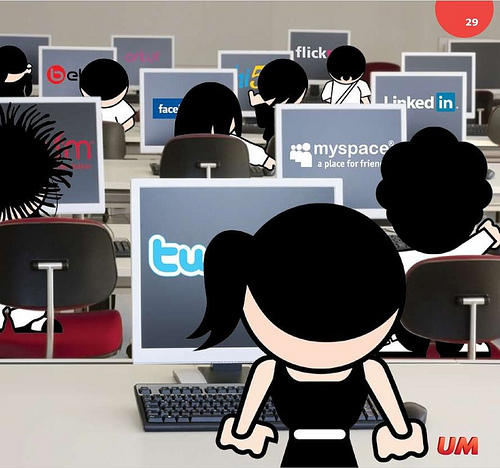

# 2.3.Programas interesantes

Vamos a aproximarnos a dos programas que nos van a ofrecer muchas posibilidades de trabajo con la PDI. El primero exclusivamente para documentos en PDF y el segundo para cualquier documento.

El trabajar con ellos no excluye usar también un programa propio de la PDI, pero puede suponer un paso inicial por su fácil manejo para el uso de la Pizarra Digital Interantiva, que es el objetivo fundamental de este curso.

Fig.1.28.Licencia: [Algunos derechos reservados](http://creativecommons.org/licenses/by/2.0/ "Attribution License") por [aabrilru](http://www.flickr.com/photos/aabrilru/) En: [http://www.flickr.com/photos](http://www.flickr.com/photos/aabrilru/4733690493/sizes/m/in/photostream/)

