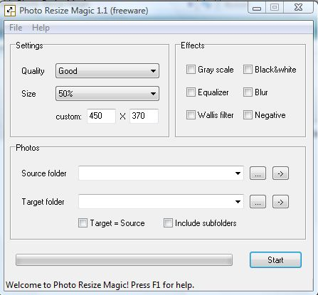

# Ampliación de Contenidos: imagen y vídeo.

## Para saber más

### Redimensionar imágenes:

En ocasiones necesitamos cambiar el tamaño de alguna imagen porque la vamos a incluir en un apresentación o en la PDI y no queremos que el archivo resultante sea demasiado voluminoso.

Para ello hay diferentes soluciones. Te propongo un programa portable y gratuito: [Photo Resize Magic](http://catedu.es/materialesaularagon2013/pdi/photoresizemagic_port.zip).

Es muy simple, pero efectivo para redimensionar imágenes en bloque. Tan sólo debes tenerlas juntas en un archivo.

Tal cual está configurado, reduciría las imágenes a la mitad. Se le indica el archivo de origen y el de guardado de las imágenes redimensionadas (puede ser el mismo) y le das a _Start_.

### Cambiar el formato de un vídeo:

\- **En internet**:

Entramos en la página: [http://www.mediaconverter.org/](http://www.mediaconverter.org/)

[Y realizaríamos la conversión](https://issuu.com/cursopdi/docs/mediaconverter).

\- **Con un programa desde el ordenador**

Descargamos Format Factory (Esta es una [versión portable](http://catedu.es/materialesaularagon2013/pdi/formatfactoryportable.zip) que no requiere instalación pero con toda su funcionalidad. Hay que dar en el icono que se llama _FormatFactory_ y se abre el programa)

Cómo funciona:

https://youtu.be/MlvJeYnapx4

