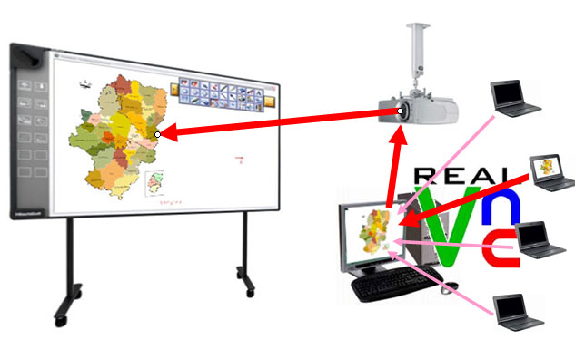
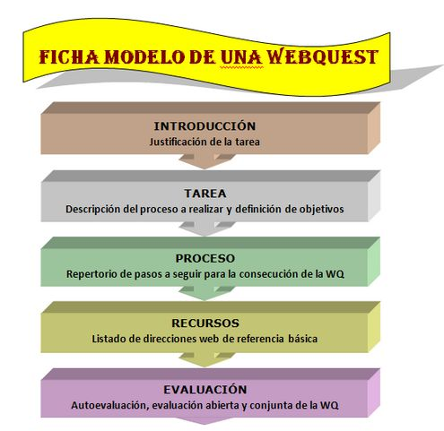

# Ampliación de contenidos: VNC y Webquest

### VNC y TEKLO:

En el **caso de que nuestro alumnado trabaje con mini ordenadores o tablet PC**, es muy interesane el poder compartir lo que han realizado en el ordenador con el resto de la clase. Para ello existen diferentes programas. Uno de ellos, que viene instalado en los ordenadores que se han entregado como equipamiento en los centros, es el **VNC** combinado con la aplicacicón **Teklo**.

**\- VNC (Virtual Network Computing)** es un programa de software libre basado en una estructura cliente-servidor el cual nos permite tomar el control del **ordenador servidor** (**alumno**) remotamente a través de un **ordenador cliente (profesor)**.

\- El **Teklo** es una aplicación creada por los profesores D. Luis Fernando Martín Rosel y D. Mariano González Montero para poder **facilitar el uso del programa VNC**.

**¿Para qué sirven Teklo y VNC?**

El uso del sistema Teklo-VNC permite al profesor tomar el control de un ordenador o miniportátil de cualquiera de los alumnos que están en la misma red.

Esta funcionalidad nos abre dos posibilidades básicas de uso:

1.  Para **controlar** lo que está haciendo el alumnado con facilidad y sin que éste se dé cuenta. Aunque no es su uso más ventajoso ni didáctico, ni debe abusarse de él, es bueno que los alumnos se sepan controlados.
2.  Para **visualizar en la PDI las aportaciones que hacen los alumnos** en su miniportátil, sin tener que desplazarse ni interrumpir la dinámica del aula. Esta es la funcionalidad más didáctica e interesante: visualizar trabajos, corregirlos, presentar informaciones con agilidad,...

Para descargar y conocer su configuración visita [FacilyTIC](http://facilytic.catedu.es/2013/04/30/control-del-aula/).

### WEBQUEST:

**¿Qué es una Webquest?**

En dos palabras es un recurso didáctico que consiste en una búsqueda de información guiada en internet.

 Extendiéndonos un poco más, se podría decir que es una herramienta que forma parte de una metodología para el trabajo didáctico que consiste en una **investigación guiada**, **con recursos principalmente procedentes de internet**, que promueve la utilización de habilidades cognitivas superiores, el trabajo cooperativo y la autonomía de los alumnos e incluye una evaluación auténtica. (wikipedia)

La definición más amplia, que incluye conceptos más complejos como el de evaluación o trabajo cooperativo, responde a una estructura o modelo que se ha ido estandarizando y que, en algunos casos, resta libertad al profesorado en su creatividad. (Fig.3.7)

No negaremos que es muy interesante conocer este modelo porque ofrece ventajas y cubre más aspectos didácticos, aunque para empezar, se puede partir por ofrecer al alumnado un reto de búsqueda por internet, independientemente de su formato o estructura.

Como docentes **hemos de formar al alumnado en la búsqueda, reflexión, verificación y contraste de informaciones mediante la navegación en internet**. 

Este es un contenido tan importante que **no podemos dejar a los alumnos sólos sin unas pautas claras** de cómo realizar este proceso. De aquí surge la necesidad de facilitarles una búsqueda dirigida, con unas pautas escritas que les eduquen en una forma correcta de desarrollarla. **Esto son realmente las webquest**.

Ejemplos de diferentes variantes:

\- **Miniquest**: versión de las Webquests que se reducen o centran tan sólo en tres pasos: escenario, trabajo y producto.

\- **Caza del Tesoro**: Consisten en una serie de preguntas y un listado de direcciones web en que el alumnado ha de buscar las respuestas. Al final, aparece la gran pregunta, cuya respuesta no debe aparecer directaente en las páginas visitadas, exigiendo al alumno integrar y valorar lo aprendido durante la búsqueda. P.ej:

[La Luz](http://www.aula21.net/cazas/cazasaula21/la_luz.html)     [Mi amigo el diente](http://perso.wanadoo.es/alhero/mipag/cazas/a_dientes/noabrir.html)

**\- Aventuras Didácticas**: Son una variante de las webquests que se articulan en torno a una investigación guiada, compuesta por varias páginas o capítulos a los que se accede secuencialmente siguiendo una trama con su inicio, nudo y desenlace.

El alumno se introducirá en el papel de un personaje, teniendo que tomar las decisiones y resolver las pruebas que vayan apareciendo.

[Segunda Guerra Mundial](http://corcosuk.wix.com/aventura-didactica)

(El formato es como un libro en el que pasar las páginas)

