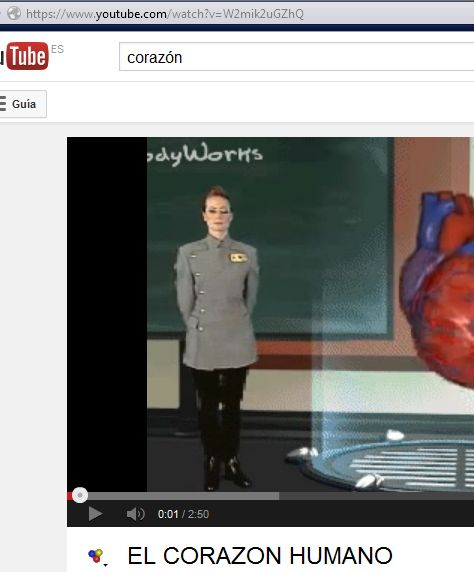
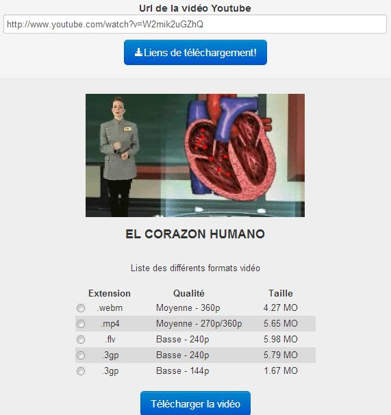
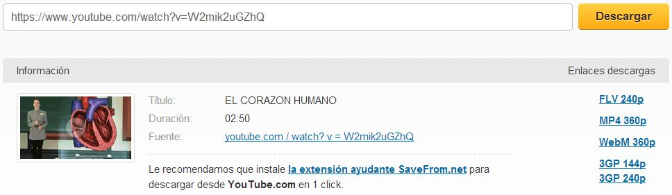
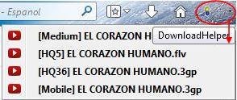

# ¿Cómo consigo vídeos?

Vamos a presentar alguna sencilla indicación de cómo conseguir vídeos para nuestra labor docente de alguno de los portales más habitualmente consultados en internet.

No vamos a profundizar mucho en el tema, que sería objeto de otro curso, pero si quieres más información puedes consultar en [FacilyTIC](http://facilytic.catedu.es/2013/05/02/bajar-un-video-desde-internet/).

Veamos un Ejercicio Resuelto.

## Caso práctico

Imagina que estás estudiando el corazón y encuentras nevegando por internet un vídeo muy intersante:

Podrías realizar un hipervínculo para verlo en clase, pero..... y si no va internet.

Necesitas un "Plan B", me da más seguridad tenerlo descargado en el ordenador.

¿Cómo lo haces?

Vamos a ver sólo dos de las múltiples posibilidades que existen:

\- Sin instalar nada en el ordenador, utilizando servicios web.

\- Instalando un plugin en el navegador Firefox.

%accordion%Solución%accordion%

**Opción 1: Sin instalación**

Exiten multitud de servicios en internet que ofrecen la posibilidad de descargar un vídeo, especialmente desde youtube. El inconveniente es que suelen ser algo inestables (hoy están y dentro de dos meses igual han desaparecido) y que van cargados de mucha publicidad, incluso solicitan instalación de plugins o de este o aquel programa.... No hay que fiarse de todo eso, hay que buscar servicios "limpios" y sencillos.

Proponemos dos:

Télécharger vidéo youtube:

[http://www.telechargervideoyoutube.com/?v=W2mik2uGZhQ/mp4/](http://www.telechargervideoyoutube.com/?v=W2mik2uGZhQ/mp4/)

(Sólo para Youtube) (Fig.2.34)

Savefrom.net: [http://en.savefrom.net/](http://en.savefrom.net/)

(Soporta múltiples portales) (Fig.2.35)

Funcionan de forma similar. Hay que copiar la dirección URL del vídeo que se quiere descargar (Ctrl+C) y se pega en el lugar habilitado para ello (Ctrl+V).

Como se puede ver ambos posibilitan la opción de descarga en **diferentes formatos**. Por facilidad de descarga y tamaño es recomendable la opción **FLV**.

Esto conlleva otro problema, relacionado con el software de la PDI, ya que este formato es bien soportado por Smart, pero no por Hitachi, por ejemplo. Es decir, el vídeo se podrá reproducir, pero no integrar en el software.

Para ello habría que **cambiar el formato** de lo que hablaremoa en "**Ampliación de contenidos**" al final del Tema.

**\-** También está [ClipConverter](http://www.clipconverter.cc/), que descarga en cualquier formato y del que encontrarás información en [FacilyTIC](http://facilytic.catedu.es/2013/10/17/clip-converter-o-como-convertir-y-descargar-fragmentos-de-videos-y-audio-de-youtube/).

**Opción 2: Instalando un Plugin en Firefox.**

Cuando ya tenemos instalado el navegador Mozilla Firefox (si no lo tienes lo puedes descargar desde [aquí](http://www.mozilla.org/es-ES/firefox/new/)), le vamos a instalar un complemento: _downloadhelper_ ([https://addons.mozilla.org/es-ES/firefox/addon/video-downloadhelper/](https://addons.mozilla.org/es-ES/firefox/addon/video-downloadhelper/)), que nos va a permitir realizar descargas de vídeo desde casi cualquier alojador de internet.

Una vez instalado y reiniciado el navegador, al localizar un vídeo en internet y abrirlo, se pondrá en movimiento un icono (unas bolitas dando vueltas) que se nos habrá instalado y junto a él una "flechita". Al pulsarla se abre el nombre del vídeo detectado y sus posibles formatos de salida (MP4 y FLV).

Pulsando la opción elegida, nos solicitará lugar y nombre para guardarlo.

Tras un proceso más o menos largo en función del tamaño del vídeo, lo tendremos en nuestro ordenador.

%/accordion%

