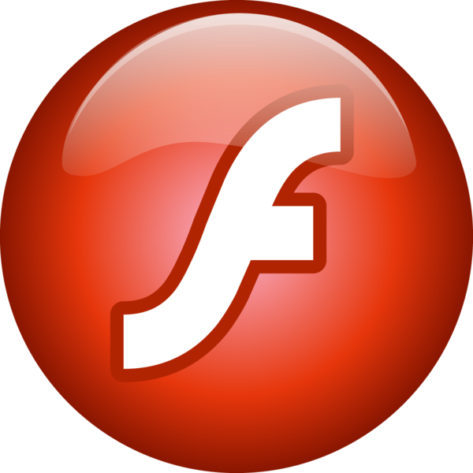
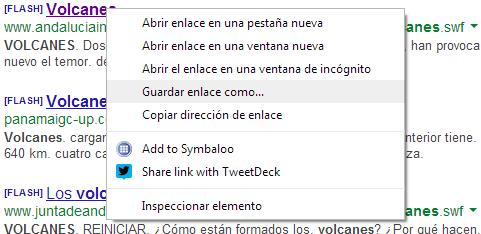
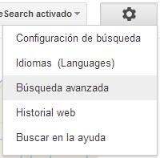
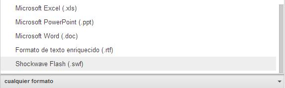
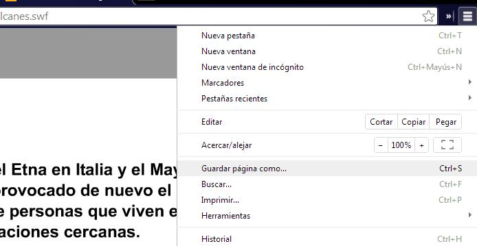
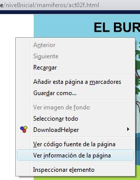
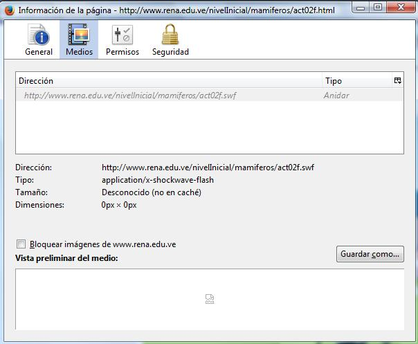

# ¿Dónde encuentro animaciones Flash?

Aunque no es uno de los temas centrales de este módulo, sí que parece conveniente dar, al menos, unas orientaciones de cómo descargar de forma sencilla animaciones Flash.

Se puede hacer **con un programa**, que instales en tu ordenador y que te permita encontar las animaciones Flash (recuerda con extensión .swf) y descargarlas. Más información en [FacilyTIC](http://facilytic.catedu.es/2013/06/19/descargar-animaciones-flash/). También instalando diferentes **extensiones o complementos en tus navegadores**, que detecten y descarguen estas animaciones (P.ej. para Chrome:[Sothink flash downloader](https://chrome.google.com/webstore/detail/sothink-flash-downloader/biceobciobbhhkplgocbaigojbnepcoi/reviews)).

Pero vamos a centrarnos en métodos más sencillo y que **sólo necesitan del uso del navegador** Chrome o Mozilla Firefox

### Proceso:

\- Entramos en el buscador **Google**. Pulsamos en **Búsqueda avanzada.**(Fig.2.26)

\- Escribimos las palabras clave para buscar. P.ej: volcán

\- Seleccionamos el **formato de archivo Shockwave Flash (.swf)** del menú desplegable.(Fig.2.27)

\- Pulsar **Busqueda avanzada**. Nos aparece un listado de direcciones web. En muchas de ellas les antecede la palabra \[Flash\] indicándonos que accedemos a una animación Flash. Podemos hacer clic y verlas para determinar si las queremos descargar o no.

**Descargamos la animación**. Existen dos maneras sencillas:

  
1.-Si estamos en el listado de búsqueda de Google. Pulsamos botón derecho del ratón sobre la dirección, y seleccionamos **Guardar enlace como...** (Fig.2.28) (**Con Chrome**)

 

2.- Si hemos entrado en la animación (se verá porque la dirección termina en .swf). Acudimos al **Menú > Guardar página como...** (Fig.2.29).(**Con Chrome**)  

Con **Mozilla Firefox**, sería Guardar como...  

Este método sirve siempre que la dirección URL, termine en .swf (P.ej.:[http://www.andaluciainvestiga.com/espanol/cienciaAnimada/sites/volcanes.swf](http://www.andaluciainvestiga.com/espanol/cienciaAnimada/sites/volcanes.swf))

## Caso práctico

¿Y si la aplicación flash que encuentro está integrada en una página web, de manera que **la URL ya no termina en swf**?

**¿Cómo la puedo descargar?**

Poe ejemplo: [http://www.rena.edu.ve/nivelInicial/mamiferos/act02f.html](http://www.rena.edu.ve/nivelInicial/mamiferos/act02f.html)

var feedbackquesFeedback0b27text = "Mostrar retroalimentación";

### Retroalimentación

En este caso utilizaremos **Mozilla Firefox**.

En la página donde tenemos la animación, hacemos clic fuera de ella con el **botón derecho** del ratón y seleccionamos **Ver información de la página** (Fig.2.30). En la página que se nos abrirá seleccionamos la pestaña _Medios_ (Fig.2.31). Aquí nos aparecerá la aplicación flash que buscamos (.swf), el damos a **Guardar como.**. y ya está.

   

   

## Importante

**No todas las aplicaciones flash se pueden descargar**, pueden estar protegidas o puede que no se descarguen completas. En esos caso deberemos conformarnos con **un enlace a la página** donde se encuentran.

