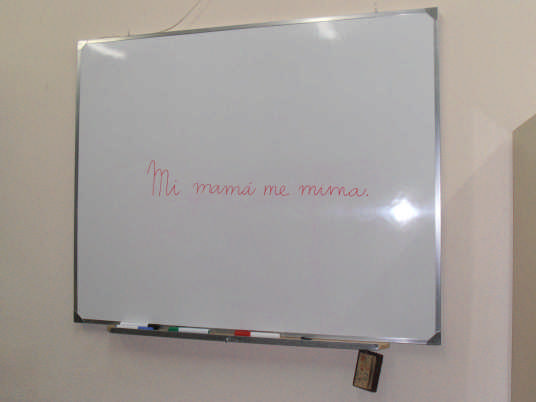
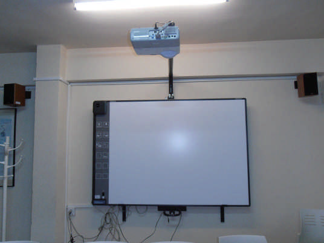

# MÓDULO 1: PRIMEROS PASOS

Cuando entramos en el aula y vemos, junto a la pizarra tradicional verde o blanca, de tiza o rotuladores, otro aparato, normalmente blanco, (parece una pizarra para escribir con rotulador, pero ya nos avisan de que no es así), y junto a este nuevo "aparato", un montón de cables que, con más o menos orden, lo conectan a un ordenador de mesa o a un tablet....

Unas cuantas preguntas nos llenan la cabeza....

¿Qué podemos hacer con esta nueva herramienta? ¿qué nos ofrece? ¿cómo funciona?......

La inseguridad nos lleva en muchas ocasiones a ignorarla y seguir con nuestras clases como si nada.

En este curso vamos a intentar conocer la Pizarra Digita Interactiva y sus posibilidades, de manera que nos podamos aproximar a ella como un recurso más a nuestro alcance. Poniendo de manifiesto sus pro y sus contras, descubriendo "leyendas urbanas", proponiendo ideas y sugiriendo alternativas con vistas a adquirir los conocimientos suficientes como para usarla cuando creamos que es lo que necesitamos para nuestras clases, pero nunca dejar de usarla por desconocimiento o temor.

## Objetivos

*   Aproximarse al concepto de Pizarra Digital Interactiva.
*   Conocer su instalación básica.
*   Reflexionar sobre sus posibilidades.
*   Descubrir las posibilidades didácticas de la PDI sin conocer ningún software específico.
*   Trabajar con algunos programas que permiten iniciarse en el trabajo con la PDI en el aula.

