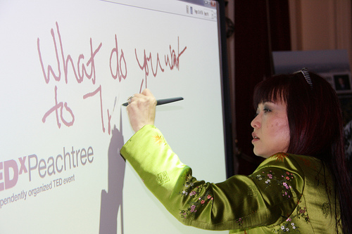

# MÓDULO 2: UN PASO MÁS

Hemos visto algunas de las posibilidades que nos ofrece la PDI utilizando programas y recursos no específicos. Vamos a ver ahora qué nos ofrece el **software específico de PDI**.

Cada marca de PDI ofrece un software propio que, aunque con una serie de **características comunes** (posibilidad de escribir "a mano alzada" en la pizarra, fondos diversos, inclusión de figuras e imágenes, recursos propios, reconocimiento de escritura,....) ofrecen **diferencias** , unas menos importantes como necesitar o no un "lápiz digital",  otras más, como los formatos en que se guardan los proyectos para su reutilización.....

)

)

Existen intentos por superar estas diferencias y crear un softwar libre para PDI y que trabaje con formatos universales, como [Open Sankoré](http://sankore.org/). La propuesta es muy buena: software libre y gratuito y un formato (.iwb) común.... pero **las grandes compañías no quieren ceder en sus privilegios** (sólo Smart reconoce ese formato y por ejemplo el puntero de Starboard de Hitachi no funciona en este programa), así que tendremos que trabajar con lo que tenemos en cada aula.

Para el desarrollo del módulo utilizaremos el software **StarBoard 9.20 de Hitachi**, por ser el que mayoritariamente se ha instalado en los centros educativos de Aragón, utilizando herramientas y recursos comunes a otras marcas. En caso necesario se comentarán posibles diferencias o se incluirán en la unidad 2 de este módulo, donde también explicaremos más sobre Open Sankoré y sus posibilidades.

## Objetivos

*   Iniciarse en el uso de programas específicos de PDI.(nos centramos en StarBoard).
*   Conocer las posibilidades que ofrece el software estudiado.
*   Descubrir la forma de aprovechar otros materiales utilizando el software de la PDI (imagen, vídeo, flash).
*   Desarrollar propuestas didácticas usando el programa estudado.
*   Concienciarse de la importancia de respetar los derechos de autor.

