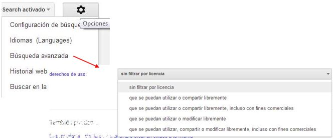
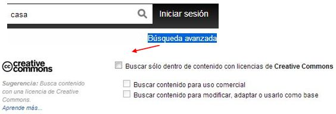

# Licencias y Permisos

En la actualidad, el profesorado tiene una gran **preocupación por los derechos de autor**. Nos encontramos básicamente con dos problemas:

1.  ¿Cómo sé si puedo utilizar un determinado material de otro autor?
2.  ¿Cómo está defendida la autoría de mi propia obra?

Estas preguntas son complejas, y escapan a nuestro curso. Además **sólo deben preocuparnos si el trabajo a elaborar va a estar público en internet**, si es para el uso interno en el aula o en el centro no suele haber ningún problema, aunque no está de más, conocer algunas orientaciones sobre la forma más adecuada de trabajar con imágenes de otros autores y **formar a nuestro alumnado en este respeto a la obra ajena**:

*   **Insertar imágenes respetando los derechos de autor**:
    
    Hoy en día, una de nuestras preocupaciones se centra en la incertidumbre de si estamos infringiendo alguna ley de derechos de autor cuando colgamos en nuestra web una imagen o fotografía, bien porque no conocemos las condiciones de su licencia, o porque no sabemos citarla correctamente.
    

  Una imagen en la **que no se indica ninguna licencia** de que se puede usar libremente, se entiende que **tiene todos los derechos reservados**.

Dos métodos para incluir imágenes "legalmente".

**1\.** Este es el sistema más evidente. **Utiliza tus propias imágenes**. Hoy en día, con las cámaras digitales, los móviles, etc. es muy fácil hacerlas, y además, personalizadas según la necesidad.

**2\.** Utilizar **imágenes con licencia creative commons**, y cítalas correctamente.

La forma correcta de **citar una imagen** es:

"Imagen 1: nombre del autor con hipervínculo al origen, tipo de licencia"

Los **hipervínculos** no violan los derechos de autor, puedes utilizar líbremente enlaces a otras páginas.

*    **Cómo buscar imágenes con licencia de uso**:

\- [Google Imágenes](http://www.google.com/imghp?hl=es): Es una de las formas más habituales de buscar imágenes en internet, pero las búsquedas que solemos realizar no filtran las imágenes por licencias... normalmente TODO tiene derechos reservados.

Fig.2.22: [Wikipedia Commons](http://commons.wikimedia.org/wiki/File:Licensing_tutorial_es.svg#filelinks), [CC-BY-SA-3.0](http://commons.wikimedia.org/wiki/Category:CC-BY-SA-3.0 "Category:CC-BY-SA-3.0")

Cuando estás en la página de **Google Imágenes** y vas a realizar una búsqueda, arriba a la derecha hay una rueda dentada que indica las **opciones**. Seleccionamos **"Búsqueda avanzada"**. Dentro de todas las posibilidades que nos ofrece esta búsqueda, la última es "**derechos de uso**". Aquí seleccionaremos la licencia que nos interese.

\- [Flickr](http://www.flickr.com/): donde se alojan y comparten gran cantidad de imágenes, tiene un **buscador específico por licencias** de uso: [http://www.flickr.com/creativecommons/](http://www.flickr.com/creativecommons/)

Pero también cuando realizas una búsqueda normal, arriba a la derecha está "**Búsqueda avanzada**" que cuenta con varios filtros de búsqueda, uno de ellos es, precisamente la búsqueda por licencia.

\- Hay **buscadores específicos**, por ejemplo [CATEDU](http://www.catedu.es/webcatedu/index.php/recursosdidacticos/recursos-libres) ha recopilado diferentes bancos de recursos tanto de audio como de imagen.

Más [Información](https://es.wikipedia.org/wiki/Creative_Commons) sobre Creative Commons.

