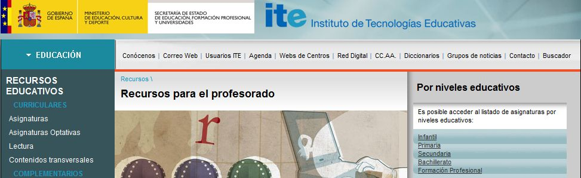

# U.1- Desde las Instituciones

En módulos anteriores se ha visto la posibilidad de encontrar recursos mediante el uso de los navegadores, realizando búsquedas personalizadas.

Pero en internet contamos con multitud de espacios que nos ofrecen **bancos de recursos** previamente seleccionados. Las primeras que se han preocupado de ello son las **Administraciones Educativas**.

El propio **Ministerio de Educación** ofrece a través del [INTEF](http://www.ite.educacion.es/intef), un banco de recursos de primera calidad ([ITE](http://ntic.educacion.es/v5/web/profesores/)), que se ha ido nutriendo de realizaciones propias y de aportes de profesores.

En esta página del ITE, a la izquierda tienes la posibilidad de buscar **por asignaturas** y a la dercha **por niveles**. Para cada recurso propuesto, hay una **ficha explicativa** y permite **trabajarlo online o descargarlo** en el ordenador.

El resto de **Administraciones Educativas Autonómicas** también tienen sus espacios dedicados a la recopilación de recursos educativos. En el siguiente esquema presentamos a la derecha del nombre de cada Comunidad el enlace a su página de recursos y, en su caso, algún breve comentario:

  
Make your own [mind maps](http://www.mindomo.com/) with Mindomo.

De entre ellas, destacamos la página del [CATEDU](http://catedu.es/webcatedu/) (Centro Aragonés de Tecnologías para la Educación) en cuya sección "recursos" encontrarás un amplio repertorio (por niveles y áreas) y un catálogo que permite realizar búsquedas detalladas de lo que necesitemos (ver "Para saber más"). Se está trabajando en el **Proyecto Facilit@mos**, que en breve ofrecerá por áreas y árbol curricular no sólo enlaces a recursos de interés, sino también unidades didácticas listas para ser puestas en práctica en aulas con el uso de las TIC, para todos los niveles educativos.

De las páginas de otras Comunidades sobresalen, por la calidad y variedad de sus recursos, **Andalucía, Extremadura, Castilla y León, Cataluña y Canarias**, aunque _todas las Comunidades ofrecen catálogos más o menos estructurados_. Unas incluyen aplicaciones para realizar búsquedas por nivel, contenido,... otras ofrecen colecciones de recursos agrupados por asignaturas o edades. Unas han elaborado recursos propios y otras se alimentan de recursos de la red.

El [Proyecto AGREGA](http://agrega.educacion.es/visualizadorcontenidos2/Portada/Portada.do), actualmente en su versión 2, ha sido un intento por **aglutinar todos los bancos de recursos** de todas las administraciones educativas en un solo repositorio.

El éxito ha sido desigual, habiendo comunidades que han aportado todos sus fondos, como Aragón y otras que han colaborado en menor medida pero, en cuanqiuier caso, sigue siendo un fondo extenso de recursos educativos de gran calidad. En "Para saber más" encontrarás orientaciones para su uso.

## Actividad

Te invitamos a **que recorras los portales** de las diferentes Comunidades Autónomas y del INTEF, veas su oferta en recursos, cómo se estructuran, qué ofrecen,.....

**Saca tus conclusiones** y **ve realizando tu propia selección** de los portales que te parecen de mayor interés para tu área o nivel.

## ParaSaberMas

Algunas orientaciones de búsqueda:

