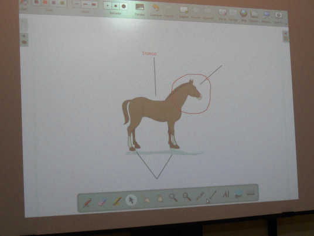

# U1. ¿Qué es la P.D.I.?

**Concepto:  
**

La pizarra digital interactiva (PDI) es un conjunto de elementos (ordenador, vídeoproyector y la pizarra propiamente dicha con su dispositivo de escritura y puntero) que permite la proyección de contenidos digitales en una superficie interactiva para compartirlos en grupo.

El principal valor añadido de este sistema, con respecto a los que se habían venido utilizando (vídeoproyector y ordenador) es que podemos actuar sobre la propia superficie de proyección (similar a lo que se realizaba sobre la pantalla del táblet) y la ejecutamos en la pizarra propiamente dicha, lo que nos proporciona una mayor capacidad de actuación; además, en función del software instalado, disponemos de un escritorio accesible con herramientas y programas para poder pasar de uno a otro de forma más simplificada.

Fig.1.3: Imagen propia

 En todo caso se trata de:

*   **Una pizarra conectada**que permite mostrar cualquier contenido que esté en Internet (páginas web, fotografías y fotomontajes o presentaciones; vídeos, animaciones infográficas o transmisiones en vivo; periódicos; mapas...)
*   **Visualizador de documentos del ordenador**(de cualquier ordenador que esté en la red del centro, del aula, de los alumnos... si usamos las herramientas adecuadas): textos, hojas de cálculo, mapas, mapas conceptuales, presentaciones, gráficos...
*   **El puntero de****tinta digital** (o el dedo) permite escribir sobre la superficie de proyección y se utiliza, además, a modo de ratón.
*   Lo que escribimos en la pizarra**se almacena en el ordenador**de forma que los alumnos pueden llevarse el contenido de la pizarra a casa.
*   Resulta un gran apoyo pedagógico porque se puede aprender más y mejor:
    *   Es una fuente de información inagotable y queda al alcance de un clic.
    *   Permite una comunicación directa con el alumnado mediante su visualización, el envío de contenidos a los ordenadores de los alumnos a través de distintos canales (correo electrónico,_intranet_...)
    *   Facilita la interacción con el alumnado y entre el alumnado: sus aportaciones pueden verse en la pizarra utilizando el software adecuado (_VNCyteklo_,_intranet_...).
    *   Permite proporcionar materiales adecuados e individualizados para el alumnado (_intranet__,pupitre_...)
    *   Favorece la motivación, la comprensión, la participación realizando clases más activas, más atractivas, más multimedia...
    *   Puede ser una herramienta que incite a renovar metodologías dependiendo de la predisposición del docente a hacerlo.
    *   Las metodologías que derivan de su uso pueden facilitar el tratamiento de la diversidad, la cooperación en la realización de tareas...
    *   Integra y hace presente el uso de las TIC en las actividades de aula, de forma que el centro está a la altura de la sociedad digital.
    *   Su sencillo manejo puede ser un factor de motivación para el profesorado.

## Reflexión

**Sin comenzar a trabajar sobre la PDI, ¿qué otras posibles ventajas puedes **apuntar** para el aprendizaje en el aula? Anota** **algunas. Si quieres conocer las que propone un estudioso sobre el tema, haz clic aquí abajo.**

var feedback12_9text = "Mostrar retroalimentación";

### Retroalimentación

Mira lo que propone [Père Marqués](http://www.pangea.org/peremarques/):

*   Resulta más cómoda que la pizarra no interactiva (no es necesario recurrir al ratón ni el teclado) para interactuar con el software. Puede hacerse directamente sobre la pizarra.
*   La escritura directa sobre la gran pantalla táctil (pizarra) resulta especialmente útil para los alumnos con pocas habilidades psicomotrices, que se inician en la escritura y para estudiantes con N.E.E.
*   Los subrayados permiten destacar algunos aspectos importantes de las explicaciones de manera natural e inmediata.
*   Permite mantener más el contacto visual con el grupo de los estudiantes
*   El gran tamaño de la pantala táctil (pizarra) facilita la interacción con los programas: selección de opciones,..
*   Puede haber una triple interacción, por ejemplo: el profesor ante el ordenador, algunos alumnos ante la pizarra interactiva y el resto de la clase participando desde sus asientos bien mediante sus ordenadores, bien mediante intervenciones directas.

## Importante

**No olvides que la Pizarra Digital Interactiva no es más que un recurso, por sí sola no posee ningún valor didáctico.**

## Actividad de lectura

Tras visionar esta presentación, vamos a pensar en si, efectivamente, el uso de la PDI y el resto de recursos tecnológicos que hay en las aulas debería implican un cambio en la forma de dar las clases.

**[Del aula analógica al aula digital](https://www.slideshare.net/dmelop/del-aula-analgica-al-aula-digital "Del aula analógica al aula digital ")** from **[Domingo Méndez](http://www.slideshare.net/dmelop)**

var feedback22\_42\_6text = "Mostrar retroalimentación";

### Retroalimentación

Desde luego tu opinión también importa, pero lee....

Algunas opiniones de compañeros y compañeras nuestros que analizan el cambio en su papel:  
  
Mi papel como profesora, es inicialmente el de presentadora (motivadora) y guía de las actividades y del modo en que se manejan algunos recursos, es decir, actuaría como modelo y como mediadora entre los alumnos, los contenidos y las “herramientas” diseñadas para transmitirles esos contenidos. Más adelante, mi rol consiste en supervisar y reorientar (en caso de que fuera necesario) las actividades que realizan los alumnos de la forma más autónoma posible, atendiendo siempre a las dudas y problemas que pudieran surgirles, y asegurándome siempre de que hacen un uso correcto y adecuado de todas y cada una de las aplicaciones. (Ana Belén López)  
  
Profesor facilitador. La figura del profesor como único facilitador del conocimiento y el alumno como elemento pasivo, tiende a desaparecer. El alumno obtiene mayor autonomía e independencia, adquiriendo un mayor control y más capacidad de decisión en el proceso de aprendizaje. El profesor se convierte, por tanto, en un punto de apoyo y de guía para el alumno debiendo monitorizar de manera constante y en colaboración con el aprendiz el aprendizaje. (Elena, profesora de idiomas)  
  
Explora, imagina, prepara, acompaña… Explora: abre tu mente a ideas que tal vez no te hayas planteado. La imaginación necesita ejemplos para nutrirse y crecer. Aliméntala bien. Imagina la forma en que ciertas experiencias que has recogido en tu exploración de posibilidades servirían para aportar una mejora en tu trabajo de clase. si sabes lo que quieres conseguir con tu enseñanza, entonces puedes llegar al punto en que la tecnología "encaja" en ella. Prepara: las actividades TIC son un recurso más para trabajar. Responden a una finalidad en el contexto de una programación de aula. Tienen que ser evaluables y evaluadas. Acompaña: ciertas "certezas de profesor" desaparecen y te encuentras, al nivel de los alumnos, con una diferencia importante: se supone que sabes a dónde quieres llegar con eso (ver el punto anterior). Entonces tu papel es más de acompañante y guía de los alumnos en un camino que ellos tienen que recorrer básicamente solos. (Fran Iglesias, proyecto Grimm).  
  
Los maestros y los alumnos están en Internet, las escuelas tienen Internet, pero el sistema escolar no está en Internet. El sistema educativo en términos de procesamiento de contenidos, de estructura pedagógica, de gestión de las escuelas, está estructurado en una forma que para introducir ese cambio tecnológico y social a la vez hay que cambiar la organización de la escuela y los currículos, hay que sacar Internet del aula de informática (además cerrada con llave) y ponerla en los currículos de todas las materias. Hay que cambiar la pedagogía. Porque no es que los maestros con Internet tengan miedo de perder el poder, es que no saben cómo enseñar con Internet, nadie se lo ha explicado. (Manuel Castells, catedrático de la UOC).  
  
Creo que la aplicación en clase de herramientas TIC conduce espontáneamente a la búsqueda de alternativas a los clásicos exámenes como método para evaluar.  
Hace tiempo que me pregunto si puede aprender nuestro alumnado sin hacer exámenes.  
Y cada vez estoy más convencido de que el trabajo mediante proyectos y las dinámicas participativas en clase difícilmente encajan con una examen al final del proceso en el que el alumnado tiene que demostrar en una hora lo que ha aprendido. Llevo unos veinte años sin hacer exámenes y ello no ha mermado en absoluto mi capacidad para aprender. -sigue...- (José María, del IES El Palo de Málaga)

