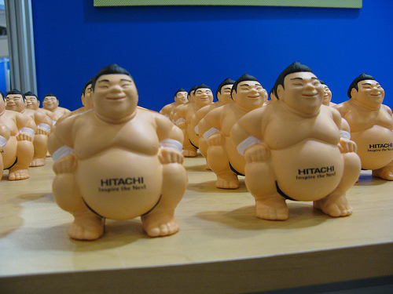
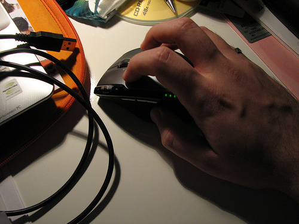
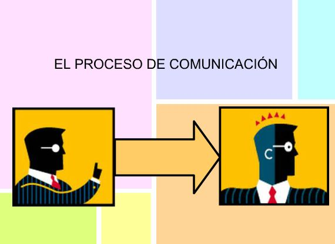

# U1. Todo empieza con un "clic"

## Previo:

Como ya se ha comentado, para practicar, **nos centraremos en el programa StarBoard 9.20** de la marca Hitachi, por ser el modelo más ampliamente instalado por el Departamento de Educación, Cultura y Deporte en los centros aragoneses. Aunque actualmente en la web sólo está accesible la versión StarBoard 9.34 o posteriores, las diferencias no son apreciables y se puede seguir el curso perfectamente con independencia de que trabajes con una u otra versión.

**El software de la pizarra puede instalarse en el ordenador de casa**, o en cualquier otro que no esté conectado a una pizarra interactiva, **y es operativo** en prácticamente todas sus posibilidades. Este hecho permite preparar actividades de aula en casa.

Si vas a trabajar sólo en el ordenador de casa, es aconsejable una **versión portable** de este software, que puedes descargar [AQUÍ](http://aularagon.catedu.es/materialesaularagon2013/pdi/starboard92portable.rar). Es más ligera (84 MB), no requiere instalación y, aunque le falta alguno de los complementos (por ejemplo no tiene materiales en la galería multimedia) que tiene la versión instalable, cuenta con todo lo necesario. Ojo! No te servirá en la PDI del aula si no tienes la versión completa del software instalada.

Te puedes descargar la **versión completa** para instalarla en tu ordenador [AQUÍ](http://www.charmexdocs.com/int/soft_starboard.html) (te explica el proceso de instalación que es un poco largo, pero el software quedará completamente instalado con todo su potencial). Crea una carpeta en tu ordenador y ve descargando ahí todos los archivos.

Todos los **manuales, ayudas, enlaces** y aspectos de interés sobre las pizarras digitales interactivas, se van recopilando en el sitio [FaciyTIC](http://facilytic.catedu.es/category/aula-digital/pizarra-digital-aula-digital/) del CATEDU (en la categoría P.D.I).

## El primer "CLIC":

Llega el momento en que nos tenemos que enfrentar al uso de la PDI, con toda la potencialidad que le da su software.

Ya hemos hecho nuestros "pinitos" en su uso y hemos visto que no es tan difícil; nos hemos animado y dado que es una pizarra.... ¿por qué no empezamos a escribir?

Recuerda... Revisamos las conexiones y cuando se proyecta el escritorio del ordenador en la PDI, busco el icono del programa.

Selecciono la herramienta _lápiz_ e intento escribir 

Lo primero que puede ocurrir es que el puntero digital o el dedo, no coincidan con el lugar donde se marca. Es necesario **calibrar** (u orientar, como lo denomina Smart) la pizarra.

Ya se comentó este procedimiento en el módulo 1, por lo que no insistiremos en ello (Módulo 1: Apartado 1.1, Elementos).

¡Funciona!. Dedico mi **primera clase** con la PDI ha **hacer un esquema**, el **desarrollo de un problema**... lo que hubiera hecho cualquier otro día, teniendo muy claro que no se trata sólo de eso, que sólo estoy empezando, familiarizándome con el nuevo medio.

Lleno la pantalla, no hay problema, **añado otra** y continúo.

Toca el timbre y no he acabado ¡vaya! Seguiremos mañana donde lo hemos dejado -me digo- y **guardo el contenido** de mi pizarra en el ordenador y mañana comenzaré en el mismo punto ..._como decíamos ayer_... Acabo al día siguiente y **lo guardo todo**; otra posibilidad: **mis alumnos pueden guardarse también mi pizarra**, una fotografía del desarrollo de mi explicación.

Hoy voy a dar un **segundo paso**, llevaré algo preparado: una imagen para proyectarla y explicar sobre ella el proceso de comunicación.(Fig.2.6).

Y me encuentro con una pizarra llena de **imágenes:** mapas, cuerpos geométricos, láminas, dibujos esquemáticos, partituras... sobre los que puedo escribir y que ven todos, no como aquéllas láminas de anatomía que sólo apreciaban los de la primera fila.

Poco a poco me iré notando más a gusto e iré incorporando nuevos recursos.

## Importante

Debes **calibrar la PDI siempre que detectes cualquier desajuste** entre puntero/dedo y la imagen, pero recuerda hacerlo **con el ordenador descogelado**, en caso contrario no se guardarán los cambios y seguirá descalibrada para la próxima sesión.

## Actividad de lectura

Mira atentamente esta presentación que nos inicia en las posibilidades de la PDI en general y del software que vamos a trabajar en particular:

<iframe id="iframe_container" frameborder="0" webkitallowfullscreen="" mozallowfullscreen="" allowfullscreen="" width="550" height="400" src="https://prezi.com/embed/3kqd6pcnmwky/?bgcolor=ffffff&amp;lock_to_path=0&amp;autoplay=0&amp;autohide_ctrls=0&amp;landing_data=bHVZZmNaNDBIWnNjdEVENDRhZDFNZGNIUE43MHdLNWpsdFJLb2ZHanI5aEJwSzAvZEIwelJBalpQaFhmYzU5UW13PT0&amp;landing_sign=8FqdSdO69txys7IOcqGvKJ_b1T1bBUg0AT4twjse2Hs"></iframe>

¿Qué opinas al respecto? ¿qué crees que nos ofrece la PDI para la labor docente?.... 

%accordion%Solución%accordion%

Por ejemplo posibilidade que nos abre Internet desde la PDI:

*   La página o páginas web que hemos encontrado adecuadas para trabajar un tema [►](http://e-ducativa.catedu.es/44700165/aula/archivos/repositorio//2500/2509/html/EDAD_2ESO_LENGUA_U5/q_5.html)
*   Podemos plantearnos mostrar varias para contrastar distintas informaciones o presentar distintas formas de ver un mismo tema [►](http://www.cambio-climatico.com/), [►](http://www.cambioclimaticoglobal.com/), [►](http://www.cambioclimatico.com/)
*   Pueden estar en nuestros favoritos o preparar un documento "lanzadera" con enlaces que permita arrancarlas [►](http://catedu.es/materialesaularagon2013/pdi/cambioclimatico.doc).
*   Presentaciones con Power Point con el contenido a explicar [►](http://catedu.es/materialesaularagon2013/pdi/lenguajeperiodistico.ppt)
*   Con el Procesador de Textos o cualquier otra aplicación adecuada al caso:
    *   Escribir [►](http://catedu.es/materialesaularagon2013/pdi/silva.doc) o presentar lo que queremos explicar en pantalla [►](http://www.claseshistoria.com/c-maps/mapa-revolucionfrancesa.html)
    *   Podemos añadir al documento enlaces, multimedia...[►](http://catedu.es/materialesaularagon2013/pdi/gonzalez.doc)
*   Actividades de aprendizaje [►](http://e-ducativa.catedu.es/44700165/aula/archivos/repositorio//4000/4234/html/EDAD_ESO_TECNO4_Q4/quincena4/imagenes2/resistencia.swf).
*   Páginas interactivas... [►](http://www.tudiscoverykids.com/juegos/leer-es-un-juego/)
*   Una enciclopedia general, temática, específica... tanto _en línea_ como fuera de línea [►](http://www.enciclopedia-aragonesa.com/).
*   Atlas [►](http://www.aularagon.org/files/espa/atlas/).
*   Servicios de geolocalización como [**Google Maps**](http://maps.google.es/).
*   Simulaciones [►](http://www.educaplus.org/play-110-Tiro-parab%C3%B3lico.html).

%/accordion%

