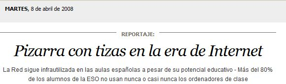

# U.2: Estamos llamados a entendernos

Una vez la **PDI** en las aulas, incluida dentro del proceso de enseñanza-aprendizaje, se plantean nuevos e **importantes retos**. No es cuestión de “saber informática” sino de **estar dispuestos a integrar las TIC como una herramienta didáctica más**.

## Importante

Los retos que nos han de motivar, como docentes, son los **RETOS PEDAGÓGICOS**. Como ya dijimos en el módulo 1:

 **NO** somos **informátic@s**, **somos DOCENTES que trabajamos con las TIC.**

La incorporación de las Tecnologías de la Información y la Comunicación ha sido y es uno de los mayores desafíos del sistema educativo.

**Hemos pasado de "aprender informática" a "aprender utilizando las herramientas informáticas"** y la PDI puede ayudar en ese proceso educativo, al servir al mismo tiempo  como vehículo de comunicación y como instrumento de intercambio.

Es, pues, **un aliado o un enemigo?** Todo dependerá de cómo nos aproximemos a esta realidad:

Adaptado de J.R. Olalla en Escuela 2.0 para Aularagon

Fran Iglesias ..." _Lo cierto es que el ente abstracto “escuela” parece querer vivir impermeable a los cambios y hasta experimenta un cierto rechazo por las propias “ciencias de la educación”. Para decirlo en pocas palabras: la escuela debería integrar la tecnología porque forma parte del abanico de herramientas que están disponibles hoy_."

## Tarea

NO OBLIGATORIA:

Te proponemos **que leas este artículo periodístico**. Es de hace unos años (2008) y **presenta un panorama ideal** de integración de las TIC en el aula.... tal vez muy similar a lo que ahora tenemos.

También **esboza algunas claves** para que esa integración sea efectiva... tal vez a eso todavía no hemos llegado.

Te invitamos a que **reflexiones sobre el tema y saques tus propias conclusiones**.

