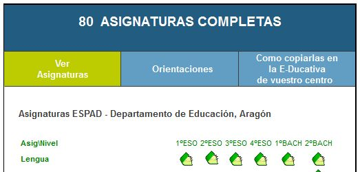
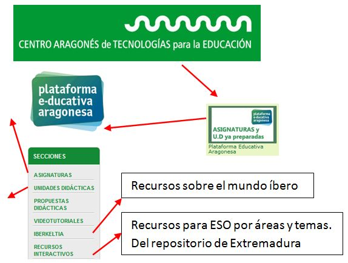
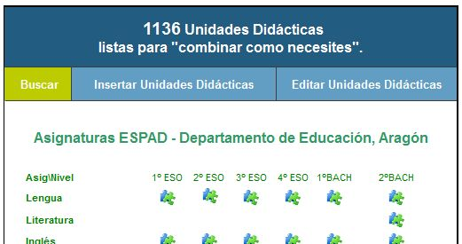

# U.2- Materiales curriculares

En internet se pueden encontrar a nuestra disposición gran cantidad de **materiales curriculares** ya elaborados. Auténticos **temarios en formato digital** listos para ser utilizados que intentan desarrollar todo o parte del currículo de una determinada área o nivel.

Aquí podemos contar con los materiales que las propias **editoriales** nos ofrecen, normalmente como complemento a los libros en formato papel y por tanto de acceso a los centros que han propuesto esos libros.

Aunque hay centros que los comparten con la red, como estos de la editorial ANAYA para Primaria ([I](http://www.ceipjuanherreraalcausa.es/index.php) y [II](http://colegioajei.es/index.php?option=com_content&view=article&id=109:recursos-interactivos-anaya&catid=64:enlaces-externos&Itemid=104)) y ESO ([1º](http://recursoseducativosdesecundaria.blogspot.com.es/2013/07/libros-digitales-anaya-1-de-eso.html) y [3º](http://recursoseducativosdesecundaria.blogspot.com.es/2013/07/libros-digitales-anaya-3-de-eso.html)) o estos otros de SANTILLANA para Primaria( [2º y 3º Ciclos](http://www.educa.madrid.org/web/cp.alarcon.valdemoro/Web/ColePAA10/LaPizarra.htm) , [5º y6º](http://aulascpes.wordpress.com/9-libros-digitales/) , [Primaria y ESO](http://recursoseducativosdeprimaria.blogspot.com.es/2013_01_01_archive.html))

Últimamente también hay **editoriales** que ofertan directamente los **libros en formato digital**,(tienes información [aquí](http://librosdetextodigitales.blogspot.com.es/)) ésto abre nuevos campos de uso de la PDI en combinación con equipos portátiles del alumno y tambien un debate sobre su conveniencia, y cómo debería ser ese material (sólo PDFs, interactivo, fotocopiable,...).

El uso que les podamos dar desde la PDI, puede ser variado, según el grado de integración de las TIC en que estemos: desde repasos, subrayados o resúmenes, hasta búsquedas guiadas o pruebas con posibilidad de consulta.

### \- **Materiales del Ministerio de Educación**:

De entre el abanico de recuros que se ofrece a través de la página del INTEF, que ya hemos visto, algunos de ellos tienen ese caracter curricular. (Ver presentación).

En [CATEDU](http://www.catedu.es/webcatedu/index.php/recursosdidacticos), para cada nivel, se pueden encontrar estos materiales del Ministerio. También en la página de [EducaRioja](http://www.educarioja.org/educarioja/index.jsp?tab=link&acc=%2Fhtml%2Fdocs%2Frecursos%2Finternet_aula.html&menu=7), aparecen muy bien clasificados por niveles.

El Ministerio ha desarrollado el [Proyecto ED@D](http://recursostic.educacion.es/secundaria/edad/), centrado en el currículum de la ESO, para las asignaturas de Lengua, Inglés, Matemáticas, Ciencias (Física y Química, Biología), Tecnología, Ética y Geografía, todas ellas para 3º y 4º de ESO y algunas también para 1º y 2º.

<iframe src="https://docs.google.com/presentation/d/10t5xQ1L7nh6HqhZGMjSguJSjAMplm48puUE1n68K01Y/embed?start=false&amp;loop=false&amp;delayms=3000" frameborder="0" width="100%" height="700"></iframe>

### \- **CATEDU**:

 En CATEDU, también surgió la procupación por preparar este tipo de contenidos y aprovechando diferentes materiales, se elaboraron **Asignaturas completas** que se pueden **trabajar online** (si eres docente de la Comunidad de Aragón, también se puede solicitar su **descarga** para trabajarlas en la Intranet, de la que hablaremos más extensamente en "Ampliación de contenidos"). No sólo se pueden trabajar las asignaturas completas, sino que se ofrece la posibilidad de trabajar cada una de las **unidades** que las componen **por separado**.

Corresponden mayoritariamente a cursos y asignaturas de **ESO y Bachillerato**, aunque también hay para **5º y 6º de Primaria**.

Estos recursos se encuentran en la plataforma [e-ducativa del CATEDU](http://e-ducativa.catedu.es/), a la que se puede acceder desde la página principal de CATEDU.

El menú de la e-ducativa da  acceso  a las [**asignaturas**](http://e-ducativa.catedu.es/unidadesdidacticas/) y [**unidades didácticas**](http://e-ducativa.catedu.es/unidadesdidacticas/) ya preparadas o a otros recursos como [Propuestas Didácticas](http://e-ducativa.catedu.es/recursosinteractivos/) (para Ciencias Sociales de ESO), [**Iberkeltia**](http://e-ducativa.catedu.es/44700165/sitio/index.cgi?wid_seccion=21) y [**Recursos Interactivos**](http://e-ducativa.catedu.es/recursosinteractivos/).

Así mismo desde la [Dirección General de Ordenación Académica](http://ryc.educa.aragon.es/sio/ini.php?iditem=68&iz=73) del Gobierno de Aragón, se publicaron una serie de Unidades Didácticas para Infantil, Primaria y Secundaria, de gran interés, con la intención de ejemplficar la puesta en práctica del Currículum Aragonés.

## Reflexión

¿Qué opinas del uso de los libros digitales? ¿Sustituirán completamente a los de texto? ¿Son, o deben ser, como los libros de texto pero en la web?..... Es un tema de actualidad y sería muy conveniente reflexionar un poco sobre ello.

En "Pulse aquí" encontrarás unos enlaces interesantes sobre el tema para que crees tu propia opinión.

%accordion%Solución%accordion%

Para que ayude a tu reflexión:

[Blog de Manuel Area](http://ordenadoresenelaula.blogspot.com.es/2013/09/de-los-libros-de-texto-los-contenidos.html) (no te pierdas los comentarios)

[Enlace I](http://www.educar.org/articulos/contralaacriticidad.asp). [Enlace II](http://www.scholarum.es/es/contenidos/secundaria/el-incierto-futuro-del-libro-de-texto).

%/accordion%

