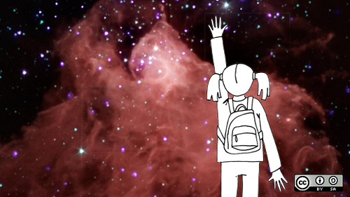

# U2. Otro software

Hay tantos programas como marcas de PDIs. Abarcarlos todos, daría casi para un temario completo. Hemos intentado contar las características de StarBoard, que son más generales a todos, pero queríamos hacer unas breves reseñas de aquellos programas de PDI que también tienen presencia en las aulas y queríamos también comentar brevemente algunas características de un software libre: Open Sankoré.

)

                                   

