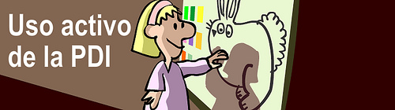

# U.3- Los profesores comparten sus recursos

Los educadores tienden a **poner en común todos aquellos recursos que utilizan**, conscientes, por un parte de lo interesante que es para ellos **tenerlos ordenados y publicados en internet** para su uso y el de su alumnado y por otro, en este entorno digital de aprendizaje colectivo, el interés que pueden tener para otros profesores que, a su vez **pueden intercambiar los recursos** que a ellos les son útiles.

En el caso de las PDIs los profesores comparten:

*   En las **comunidades creadas por algunas empresas de PDI** que se han preocupado de favorecer estas comunidades de intercambio:

\- **Smart**: [http://exchange.smarttech.com/index.html?lang=es_es](http://exchange.smarttech.com/index.html?lang=es_es)

\- **Promethean**: [http://www1.prometheanplanet.com/es/](http://www1.prometheanplanet.com/es/)

El resto, o no tienen un espacio dedicado a recursos educativoso es bastante pobre (como [interwrite](http://www.artigraf.com/InterWrite/cire.htm#recursos_gwb)).

La ventaja de estos recursos es que suelen estar listos para ser usados en el aula. El inconveniente, que suelen estar realizados en el software propio de esa pizarra (por tanto no utilizable en otras marcas).

Fig.4.1.Licencia [Algunos derechos reservados](http://creativecommons.org/licenses/by-sa/2.0/ "Attribution-ShareAlike License") por [nestoralonso](http://www.flickr.com/photos/nestoralonso/) En: [Flickr](http://www.flickr.com/photos/nestoralonso/4338575646/sizes/m/in/photostream/)

*   En **sus Blogs o Páginas web**, individuales o de centro. Hay muchos ejemplos de ello y sería imposible ponerlos todos, así que sólo mostramos algunos ejemplo interesantes:
    *   Centros:
        *   [C.E.I.P. Ntra. Sra. del Pilar de Monreal del Campo](http://e-ducativa.catedu.es/44002152/sitio/index.cgi?wid_seccion=33&wid_item=29) (Teruel). Con una selección de recursos de Infantil hasta 1º de ESO.
        *   [C.E.I.P. Valdespartera](http://catedu.es/arablogs/blog.php?id_blog=1600) (Zaragoza). Que comparten los recursos utilizados de Infantil a 6º de Primaria.
        *   [C.E.I.P. Ntra. Sra. de Loreto](http://www.ceiploreto.es/) (Dos Torres - Córdoba). Con recursos de Infantil a 1º de ESO.
        *   [I.E.S Salvador Victoria](http://iesmonre.educa.aragon.es/) (Monreal del Campo - Teruel). Con recursos elaborados desde el centro.

*   *   De Profesor, Aula o Materia:
        *   [Matryc](http://catedu.es/matryc/index.php?option=com_content&view=article&id=53&Itemid=81): Sobre matemáticas para la ESO.
        *   [Blog de 5º](http://nuestroblogde5primaria.wordpress.com/): Con enlaces de todas las materias
        *   [Recursos para CCSS](http://contenidos.educarex.es/sama/2010/csociales_geografia_historia/index.html): Todo para ciencias sociales, geografía e historia en la ESO.
        *   [Primertic](http://www.catedu.es/arablogs/blog.php?id_blog=2143): Recursos para el primer ciclo de Primaria.
        *   [Recursos para la PDI](http://recursospdi.wordpress.com/): Para toda la Primaria.

*   En espacios para **compartir en red** (web 2.0). Entre otros: [Slidesahre](http://www.slideshare.net/?ss), [Scribd](http://es.scribd.com/), [Issuu](http://issuu.com/), [YoutubeEdu](https://www.youtube.com/education),... Un ejemplo:

**[Recursos Secundaria y Bachillerato](https://www.slideshare.net/carmenmellado/recursos-secundaria-y-bachillerato "Recursos Secundaria y Bachillerato")** from **[carmenmellado](http://www.slideshare.net/carmenmellado)**

*    A través de los **marcadores sociales**: Los marcadores sociales vienen a ser los "favoritos" de siempre pero alojados en intrenet, de manera que están accesibles desde cualquier ordenador. Y no sólo eso, también se pueden compartir y así crear auténticas **comunidades**, en nuestro caso de **docentes, con enlaces compartidos.** Muchos de estos servicios te permiten buscar contenidos mediantes "tags" o etiquetas, aun sin estar registrado ([Mister Wong](http://www.mister-wong.es/), [Diigo](https://www.diigo.com/search/)) otros ([Delicious](https://delicious.com/)) requieren registro previo.

## Caso práctico

Imagina que has ido navegando por internet y has encontrado gran cantidad de páginas interesantes, con recursos, que te podrían ser muy útiles para tus clases.

¿Cómo te planteas poder ir almacenándolas, organizándolas, compartiéndolas con alumnos o compañeros?

var feedbackquesFeedback0b27text = "Mostrar retroalimentación";

### Retroalimentación

Podrás encontar soluciones de lo más variado y conforme a tu forma de trabajo o preferencias. Ya hemos visto algunas formas, como lo que hemos venido denominado "lanzaderas", es decir **páginas de texto, de una presentación o del software de nuestra PDI, con los enlaces** para ser utilizados.

Pero existen otras soluciones:

\- Los navegadores ofrecen la posibilidad de guardar **marcadores o favoritos**, al tiempo que navegamos. El inconveniente es que si cambiamos de equipo, los enlaces guardados no están. Una solución podría ser trabajar con un **navegador portable** colocado en un lápiz de memoria que se lleva de un equipo a otro, pero... ¿y si se estropea o se pierde? Para compartirlo, deberías hacer una copia del programa.

\- Con una **cuenta de gmail**, tenemos acceso a los marcadores que nos ofrece google ([**Google** Bookmarks](https://www.google.es/bookmarks/?hl=es)). Son accesibles desde cualquier ordenador pero sólo si tienes los datos de acceso a esa cuenta. Puede ser una solución para un grupo profesional, o un aula.

\- Internet nos ofrece los **marcadores sociales** (que hemos comentado arriba) que permiten no sólo guardar los enlaces que nos interesan, sino organizarlos y, si se desea, compartirlos. Para profundizar en el tema aquí tienes estos materiales:

[Marcadores Sociales](http://www.ite.educacion.es/formacion/materiales/157/cd/m6_2_marcadores_sociales/index.html) (Curso del ITE sobre Mr. Wong y Delicious)

[Marcadores Sociales](http://recursostic.educacion.es/observatorio/web/es/internet/web-20/969-marcadores-sociales-mister-wong-diigo-y-delicious) (Observatorio Tecnológico sobre Mr. Wong, Diigo y Delicious)

