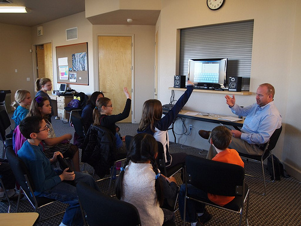
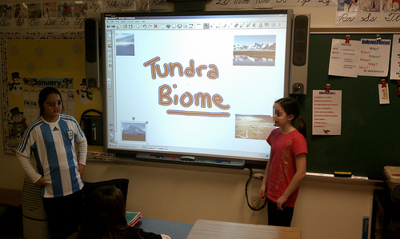
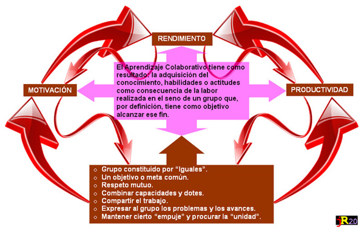

# U.5: Cambios de rol

Tras todo lo visto hasta ahora, parece claro que la **exposición tradicional, exclusivamente por parte del profesor**, ya **no tiene sentido** a la hora de usar las tecnologías dentro del aula. **Alumnos y alumnas deben ser los verdaderos** **protagonistas** del proceso educativo.

Las **metodologías** aplicables al trabajo con la PDI son variadas: Constructivismo, Proyectos de Trabajo, Aprendizaje Colaborativo,.... (Si quieres profundizar en alguna de ellas mira en "Para saber más") Todas ellas complementarias y aplicables en nuestras aulas. Nos vamos a detener brevemente en el **modelo MIE-CAIT**, ya que, aunque con unas premisas similares (enseñanza activa, centrada en el elaumno) sitúa el proceso enseñanaza-aprendizaje en un entorno tecnológico y busca el uso de las TIC como instrumentos de conocimiento.

Según el **modelo MIE-CAIT**, \[**M**ediador (papel del profesor), **I**ndividualización (de la enseñanza para atender la diversidad), **E**valuación (de la actividad de los estudiantes y el proceso), **C**onstructivo (construir conocimientos procesando la información), **A**utorregulado, (por los propios alumnos),**I**nteractivo (con el entorno y trabajo colaborativo),**T**ecnológico.(aprender con la tecnología para avanzar en conocimientos)\]:

_**Aprender no sólo es adquirir información, sino desarrollar habilidades y destrezas que permitan seleccionarla, organizarla e interpretarla hasta ser capaces de aplicar con éxito ese conocimiento en situaciones nuevas (**_Texto completo en "Para saber más"_**).  
**_

Fig.3.2.Licencia [Algunos derechos reservados](http://creativecommons.org/licenses/by/2.0/ "Attribution License") por [flickingerbrad](http://www.flickr.com/photos/56155476@N08/)

En: [http://www.flickr.com/](http://www.flickr.com/photos/56155476@N08/6659980643/sizes/m/in/photostream/)

Fig.3.3.Licencia [Algunos derechos reservados](http://creativecommons.org/licenses/by/2.0/ "Attribution License") por [kjarrett](http://www.flickr.com/photos/kjarrett/)

En: [http://www.flickr.com/](http://www.flickr.com/photos/kjarrett/5339132310/sizes/m/in/photostream/)

El **docente** debe ser el **intermediario** entre los aprendizajes, el contexto y los estudiantes, **orientando todo el proceso**: seleccionando o incluso creando los recursos, indicando dónde y cómo obtener información, presentándola de forma estructurada y motivante, favoreciendo el diálogo e intercambio entre todos y utilizando los medios tecnológicos a favor del apendizaje.

  
En este contexto, la **pizarra digital es un gran aliado**  tanto para compartir y mostrar contenidos dentro del aula, como para mostrarlos al exterior y compartirlos con otros grupos.

## Tarea

Resuelve y reflexiona sobre los nuevos roles de profesor y alumno:

## ParaSaberMas

\- Si quieres profundizar en el modelo **MIE-CAIT**:

[Modelo CAIT](https://www.slideshare.net/grabajoli/modelo-cait "Modelo CAIT") from [Graciela Rabajoli](http://www.slideshare.net/grabajoli)

\- También puedes consultar la página de Pere Marqués: [http://peremarques.pangea.org/miecait.htm](http://peremarques.pangea.org/miecait.htm)

\- [Texto](https://drive.google.com/file/d/0B7FUMXVVYuSOTHFIbkE3SjdmNGs/edit?usp=sharing) del curso Integración de la TIC de aularagon.

\- **Constructivismo y TIC**: Consulta este [artículo](http://www.monografias.com/trabajos901/incorporacion-tics-contexto-educativo-constructivismo/incorporacion-tics-contexto-educativo-constructivismo.shtml#Relacionados).

\- **Aprendizaje por Proyectos**:

**[Aprendizaje Por Proyectos](https://www.slideshare.net/camog70/aprendizaje-por-proyectos "Aprendizaje Por Proyectos")** from **[camog70](http://www.slideshare.net/camog70)**

\- **Aprendizaje Colaborativo**: se propone este [artículo](https://drive.google.com/file/d/0B7FUMXVVYuSOTFlEdnJzSUxPM2M/edit?usp=sharing) sobre el aprendizaje colaborativo y las TIC.

  

Fig.3.4. de J.R. Olalla para Escuela 2.0

