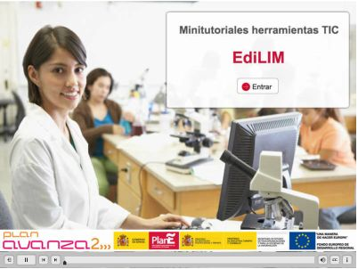
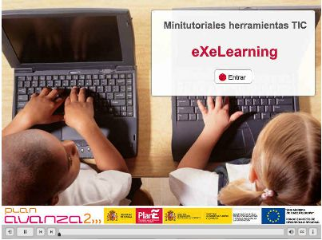
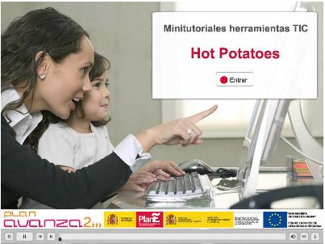
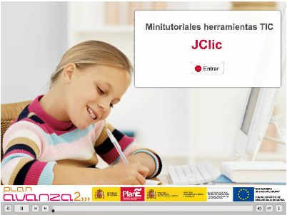

# U.5- Lo busco o lo creo?

Llegados a este punto y tras experimetar con la multitud de recuros que hemos visto (y muchos más que hay en la red), puede ser que se nos plantee esta disyuntiva.

**Utilizar los recursos que hay** a nuestra disposición para la creación de nuestros objetos digitales de enseñanaza (ODE), está muy bien, pero en ocasiones pueden suponer **mucho tiempo** de búsqueda y tal vez **los resultados no son los esperados** o **no se ajustan** del todo a lo que estábamos buscando.

**Crear nuestos ODEs**, puede parecer excesivamente complejo pero de hecho ya lo hemos estado haciendo con el **software de la PDI** o con **documentos de texto** o **presentaciones**.... no serán tan "espectaculares" como una animación flash, pero pueden servir perfectamente a nuestros objetivos educativos. Por ejemplo la reutilización de una explicación en la PDI o la grabación de la misma:

[GomGar Sol](http://www.youtube.com/user/Soledadgomezgarcia?feature=watch)·en [Youtube](http://www.youtube.com/)

Existen una serie de herramientas, las **herramientas de autor**, que permiten crear objetos digitales de enseñanaza (ODE) de forma muy sencilla pero con resultados muy eficaces. Aunque no son objeto de este curso (existe un curso en Aularagón dedicado a ellos), te presentamos las características de algunas de las más usadas:

[EdiLIM](http://www.educalim.com/edilim.htm), [eXeLearning](http://exelearning.net/), [HotPotaoes](http://hotpot.uvic.ca/) y [JClic](http://clic.xtec.cat/es/jclic/download.htm) (por ejemplo este cursos se ha construido con eXeLearning).

Algunas de estas herramientas ofrecen, sus propios **bancos de recursos**:

[EducaLIM](http://www.educalim.com/biblioteca/index.php): biblioteca de recursos hechos con EdiLIM.

[zonaClic](http://clic.xtec.cat/db/listact_es.jsp): búsqueda de actividades en JClic.

[HotPotatoes](http://www.educa.madrid.org/portal/web/educamadrid/hotpotatoes) para todos los niveles (Infantil a Bachillerato) de EducaMadrid.

De **eXeLearning**, no tenemos un banco de recursos, pero presentamos unos ejemplos [1](http://www.cepazahar.org/recursos/file.php/46/Proyectos/Miguelhernandez/index.html) y [2](http://s335272561.mialojamiento.es/CD/index.html)

Existe otra herramienta, **Ardora**, de la que puedes encontrar información en [FacilyTIC](http://www.catedu.es/facilytic/2013/04/30/ardora/).

## Importante

Utilices recursos propios o de la red **no es bueno improvisar**. Deberás **prever los recursos** a utilizar en cada sesión (descargarlos en el momento puede retrasar la actividad por problema en la red o cualquier otro imprevisto) y tenerlos preparados. Lo mismo ocurre si hay que ir a **páginas web** (abrirlas previamente para que queden en la caché), tener preparadas las búquedas o sitios a visitar. Y, como ya se comentó en el módulo 1, **tener prevista una alternativa, un plan B**.... por si algo falla....

## Actividad de lectura

Lee atentamente este artículo: [Actividades educativas, si no las encuentras...¡Créalas!](http://www.educacontic.es/blog/actividades-educativas-si-no-las-encuentras-crealas)

De Mª Jesús Camino en [Educ@conTIC](http://www.educacontic.es/blog/actividades-educativas-si-no-las-encuentras-crealas)

Vas a reflexionar sobre lo que se nos cuenta y propone. Te animamos a que pruebes alguna de las aplicaciones sugeridas, especialmente las que son online y no requieren ninguna instalación.

var feedback34\_36\_6text = "Mostrar retroalimentación";

### Retroalimentación

Si quieres probar con programas como eXeLearning, HotPotatoes, JClic, EdiLIM o Ardora, puedes utilizarlos sin instalar, en su versión portable que se encuentra en [PROKIT](http://www.catedu.es/webcatedu/index.php?option=com_content&view=article&id=212) de CATEDU.

