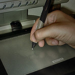
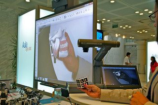

# U.6- Algunos accesorios

Hemos estado viendo el uso de la PDI con diferentes recursos didácticos pero sin mencionar los utensilios con los que se puede complementar ese uso. Sí que se mencionó, al principio del curso, el puntero y su utilidad, pero digamos que éste es un accesorio necesario para el manejo de la PDI... Nos estamos refierendo a otro tipo de **aparatos periféricos** que, sin ser recursos didácticos, nos van a permitir **potenciar las posibilidades didácticas y de uso de la PDI**:

### \- Cámara (o lector) de Documentos:

Se trata de un aparato con aspecto de lámpara de mesa que lleva incorporada **una cámara para poder captar lo que se pone bajo ella**. Suelen disponer de iluminación, enfoque, adaptador a microscopio (ésto sólo algunos modelos),... lo que unido al software propio de la PDI, hace que se pueda **interactuar sobre lo proyectado en la pantalla**.(Se mencionó en 1.3 del Módulo 1)

Imagina el potencial que ésto puede tener: proyección de una lámina, un cuaderno, un libro, ver la manipulación de un objeto, uso de la realidad aumentada (ver en "para saber más")....

Pere Marqués, resume **algunas de sus posibilidades** en esta presentación.

Son aparatos que en los últimos tiempos se han hecho económicamente bastante accesibles, pero hay una **alternativa, todavía más económica** y, si exceptuamos algunas funcionalidades como el adaptador al microscopio de algunos modelos o el caso de las PDI Smart con una conexión específica para las cámaras de su propia marca, igualmente efectiva, que es el uso de **una webcam con un soporte**.

  
<iframe src="//www.slideshare.net/slideshow/embed_code/key/bW41xAsBhEIkJs" width="595" height="485" frameborder="0" marginwidth="0" marginheight="0" scrolling="no" style="border:1px solid #CCC; border-width:1px; margin-bottom:5px; max-width: 100%;" allowfullscreen> </iframe> 
 <strong> <a href="//www.slideshare.net/peremarques/11-modelos-de-uso-didctico-de-la-cmara-de-documentos" title="11 modelos de uso didáctico de la cámara de documentos" target="_blank">11 modelos de uso didáctico de la cámara de documentos</a> </strong> from <strong><a href="https://www.slideshare.net/peremarques" target="_blank">PERE MARQUES</a></strong> 

Aquí vemos un ejemplo de su uso:

https://youtu.be/iAKuDT_dOxY

Si la cámara de documentos puede abrir un amplio abanico de posibilidades, (o su alternativa la webcam) existen otros elementos que también pueden favorecer la interacción con la PDI y aumentar, especialmente, la **participación del alumnado**.

Son los **periféricos inalámbricos**:

### **Tableta Gráfica**

https://youtu.be/_ZmIX_QjDzE

### **Teclado y ratón inalámbricos**

Según Pere Marqués, estos dispositivos inalámbricos **permiten facilitar e incrementar la participación del alumnado** en actividades como: Síntesis en clase, realización de ejercicios entre todos, los estudiantes hacen de profesores, debates con apoyo multimedia,....

_-Se pueden ir pasando a diversos alumnos para que, desde su mesa, vayan escribiendo,con el teclado inalámbrico, en la pizarra digital sus aportaciones de manera sintética, antes o después de comentarlas con más detalle a todos sus compañeros._

_-Pueden ir realizando los ejercicios en la pizarra digital interactuando desde su mesa con la tableta._

_-Mientras un estudiante hace comentarios interactuando con el puntero sobre la superficie de la pizarra digital, otros pueden hacer también anotaciones complementarias en la pizarra escribiendo con la tableta o teclado._

_-Los estudiantes pueden ir escribiendo sus aportaciones a medida que las comentan desde su propia mesa._

Además **permiten** también **al** **profesor** **manejar**, de igual manera, **la PDI desde cualquier lugar del aula**, lo que también puede facilitar la interacción.

### \- Mandos Interactivos:

Son unos aparatos similares a un mando a distancia, **para que el alumnado pueda responder** mediante la elección de la opción correcta **a una serie de preguntas lanzadas por el profesor**.

Permiten, entre otras cosas:

\- La corrección inmediata.  
\- Comparar respuestas de distintos grupos de alumnos.  
\- Facilitar el seguimiento a alumnos concretos.  
\- Hacen posible compartir los resultados con los alumnos en tiempo real.  
\- Permiten detectar los puntos del temario que no han sido bien asimilados o requieren un refuerzo.

El inconveniente es que suponen una inversión importante ya que hay que tener uno para cada alumno.

Puedes ver esta [entrada del Blog](http://www.catedu.es/arablogs/blog.php?id_blog=2398&id_articulo=165827), sobre el uso de los sistemas de participación y respuesta.

Si quieres ampliar sobre el tema, aquí tienes un [estudio realizado](http://formacion.enlinea.educa.madrid.org/itic10/comunicaciones/losmandosinteractivos.pdf) a partir de su aplicación en el aula.

## Reflexión

¿Habías pensado en el uso de alguno de estos accesorios? Lo cierto es que muchos de ellos no requiere ni gran inversión económica ni conocimientos técnicos de uso, es sólo buscarles posibilidades didácticas.

¡Seguro que se te ocurren montones de ideas!

%accordion%Solución%accordion%

Para enriquecer este aporte de ideas sobre el uso de diferentes accesorios con las PDI, aquí tienes algunos artículos de opinión interesantes:

Celestino Arteta en [Educación Tecnológica](http://villaves56.blogspot.com.es/2013/06/el-valor-didactico-de-la-camara-de.html#.UoHmrSf9UhA). Sobre la cámara de documentos/Webcam

Blog "[Tecnología y Educación](http://www.tecnologiayeducacion.com/la-tableta-una-mini-pizarra-interactiva/)". Sobre las tabletas gráficas.

%/accordion%

## Para saber más

Como se ve en la imagen y como se ha comentado más arriba, **las cámaras de documentos y las webcam**, permiten introducir en el aula el uso de un recurso nuevo: **la realidad aumentada**.

Básicamente, se trata de unos dibujos en blanco y negro (Markers), que al ser observados mediante una cámara a través del ordenador y con el uso de un software específico, permiten ver y manipular objetos en 3D.

En [CATEDU](http://www.catedu.es/webcatedu/index.php/descargas/realidad-aumentada), en la zona de descargas, encontrarás amplia información sobre el tema y manuales para su puesta en marcha.

Una vez instalado el programa, y seleccionado el tema que te intersa, tienes que descargar el pdf con los "marker", que es lo que se coloca bajo la webcam, y las escenas, que hay que abrir con el programa descargado.

